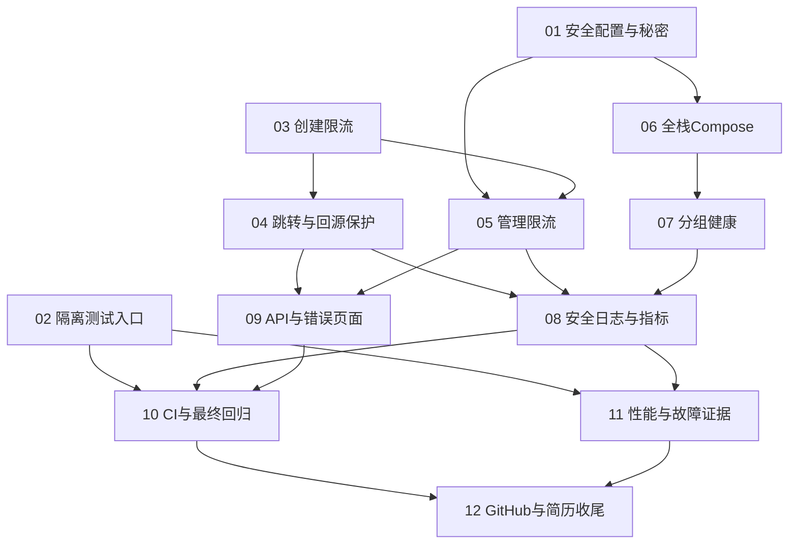

# 阶段 8 任务拆分与发布索引

日期：2026-10-04（Asia/Shanghai）

状态：用户已确认粒度与依赖，12 张独立任务已发布，均为 ready-for-agent；未认领或开始实现。

依据：[实现规格](spec.md)、已接受的最终设计与 ADR-0008。用户调用 to-tickets 授权任务拆分；按技能要求先评审，再逐张发布。规格状态和已接受设计保持不变。

## 拆分原则

- 共 12 张任务，每张交付一个可演示或独立验证的完整行为，并在本张内完成对应测试与必要说明；不拆成“只写Lua”“只改控制器”“最后再补测试”。
- 使用现有单应用与缓存、发号、持久化、时钟、HTTP测试边界；没有已确认必须先做的大范围重构。必要局部提炼随首个使用它的完整切片完成，不单独制造重构任务。
- 依赖仅包含真实前置，不因推荐执行顺序添加串行边。编号为拓扑顺序；没有列为依赖的任务不必等待。
- 每张适配一个新的上下文窗口；若实施发现任务超出边界，应先报告并重新拆分，而不是扩展业务或跳过验收。
- 用户确认后每张已单独发布，状态为 ready-for-agent，Blocked by 使用编号；没有认领、执行、关闭或改动父规格。

## 01：安全默认配置与独立秘密初始化

**What to build:** 使用者第一次运行时不会意外开放管理入口或采集访问，能够生成稳定、独立的本地秘密；显式配置后原有创建、管理和统计能够正常使用。

**Blocked by:** None（无前置依赖）。

**故事覆盖：** 21、32～35，以及运行秘密安全边界。

- [ ] 管理令牌无默认值；未配置时管理入口保持404，缺失/错误/重复头保持401且不进入业务。
- [ ] 基础采集默认关闭，启用采集必须提供有效独立HMAC；消费者默认开启，停采不等于停止历史消费。
- [ ] 提供一次本地初始化生成管理令牌、HMAC及后续DB/MQ凭据，真实配置被Git忽略，示例仅占位。
- [ ] 普通重复初始化/重启不擅自替换现有秘密，UV身份密钥保持稳定；轮换/数据重置另有明确说明。
- [ ] 输出、日志、构建素材不出现秘密；公开创建/跳转不增加管理令牌要求。
- [ ] 无配置、非法配置、显式开启以及正常业务的配置/MVC验收通过，同步默认行为说明。
- [ ] 此任务生成供部署使用的配置，不代替后续实际创建数据库/broker账号和vhost。

## 02：自动准备隔离设施并复现现有回归

**What to build:** 维护者能在干净环境用明确入口运行无设施测试和既有真实设施回归，不需要私人MySQL或RabbitMQ，且看到真实失败和安全报告。

**Blocked by:** None（无前置依赖）。

**故事覆盖：** 45、47，以及既有测试可复现性。

- [ ] 无设施单元/MVC与真实设施集成有明确入口和设施要求，提供Windows pwsh与Linux运行方式。
- [ ] 延续现有Testcontainers，为遗留外部设施测试自动准备独立MySQL/Redis/RabbitMQ及所需账号/vhost/policy，允许独立测试Compose。
- [ ] 数据库、端口、vhost与演示/个人环境隔离，失败定位及设施清理明确，不删除个人数据。
- [ ] 现有创建/跳转、缓存、管理、MQ幂等/故障、统计查询/清理和生命周期回归能够完整运行；至少确认一个真实创建→跳转→异步统计往返。
- [ ] 缺Docker/配置或初始化失败必须明确报告，不静默跳过必测项，不把“设施启动”当业务通过。
- [ ] 启停和报告不打印秘密；测试结果记录失败/错误/跳过，历史263项通过不作为本任务运行证据。
- [ ] 不为统一形式重写全部测试，不在本任务修改生产默认配置；测试配置显式、与任务01解耦。

## 03：匿名创建的Redis Lua令牌桶与拒绝语义

**What to build:** 匿名创建者正常创建仍得到201，过快请求得到429和等待提示，Redis限流无法确认时在业务开始前收到独立503；页面不会把它误认为已保存。

**Blocked by:** None（无前置依赖，真实Redis验收可复用现有Testcontainers）。

**故事覆盖：** 5～9、25～28、30，以及公共限流判定能力。

- [ ] 交付一个内聚限流判定模块及真实Redis/Lua实现，HTTP只得到获准/拒绝/不可用和等待提示，不额外增加泛化框架。
- [ ] 创建按连接对端IP，容量3、每6秒补充1，可配置并启动校验；忽略伪造Forwarded/X-Forwarded-For。
- [ ] 在请求体解析、发号、插入之前准入；获准后业务/参数失败不退令牌，明确拒绝不扣成负数。
- [ ] 429使用RATE_LIMIT_EXCEEDED、向上取整Retry-After和no-store；限流不可用独立503无发号/写库副作用，与已有已提交协调未确认503区分。
- [ ] 页面正确解释新增429和业务前503，仍展示已有部分完成短码，不增加页面新业务。
- [ ] Lua短且有界，Redis TIME、桶容量/补充/TTL、命名空间隔离、EVALSHA/NOSCRIPT恢复及超时不盲目重扣符合规格。
- [ ] MVC拒绝无副作用、真实Redis最后令牌竞争、独立应用上下文共享桶、补充/TTL、脚本重载及执行后丢响应验收通过。
- [ ] 使用现有真实设施测试方式即可独立完成，不将任务02视为必须先落地的生产功能依赖。

## 04：跳转限流与实际回源并发保护

**What to build:** 访问者以宽松额度访问，合法换码扫描共享IP额度；Redis限流故障仍可跳转，但实际数据库加载受并发保护，拒绝不会产生访问统计。

**Blocked by:** 03（复用已交付的判定模块、Redis脚本和HTTP拒绝契约）。

**故事覆盖：** 10～17、22～24，以及核心池预算。

- [ ] GET/HEAD按对端IP跨短码共享桶，容量60、每秒补充10，可配置，独立于创建组。
- [ ] 非法短码廉价格式校验先执行，保持404且不访问Redis/MySQL；合法格式再限流，合法不存在短码消耗额度。
- [ ] Redis限流失败采用fail-open，保留版本缓存/受控恢复和逐请求有效性校验；明确额度不足返回429。
- [ ] 实际数据库加载每实例最多4、可配置；正常miss、无版本故障回源及等待超时后的独立查询均适用。
- [ ] 缓存命中和共享等待不占许可，一次共享实际查询仅占一次；真实查询结束释放，无许可立即独立503，不增加等待队列或负缓存。
- [ ] 核心池最大8、获取连接等待500ms作为可配置起点；统计池既有最大4及准入保持，不把回源许可说成独占连接预留。
- [ ] 429/回源503无统计Cookie、访问事件或PV/UV，HEAD无体且不计数；正常GET放行最终跳转仍可采集。
- [ ] 并发在途/异常释放/共享任务/缓存命中测试以及真实Redis故障回源验收通过，原缓存一致性和统计口径回归保持。

## 05：鉴权后的管理写入与查询限流

**What to build:** 管理者通过原有鉴权后，状态修改和统计/明细查询使用隔离额度；未授权请求继续按原契约拒绝，不依赖限流Redis。

**Blocked by:** 01、03（安全默认管理边界与可复用限流模块）。

**故事覆盖：** 18～21，以及管理组独立故障策略。

- [ ] 鉴权先于限流、参数/请求体解析；未配置404及无效/重复令牌401保持，不访问Redis/MySQL。
- [ ] 状态修改使用固定共享管理写桶，容量5、每秒补充1，不把原始令牌放入Key。
- [ ] 统计和明细GET/隐式HEAD共用固定管理查询桶，容量5、每秒补充1，与管理写/公开组独立。
- [ ] 获准后业务失败不退令牌；额度不足429，限流不可用业务前独立503，不执行状态更新或查询。
- [ ] 原有重复状态409、过期优先、MySQL提交/缓存协调未确认、查询忙/超时等错误保持，不把所有503当部分完成。
- [ ] 管理页面必要错误提示及无持久令牌规则保持；鉴权拒绝、组隔离、两个查询共用、HEAD和Redis故障真实/MVC验收通过。

## 06：全栈Compose运行、持久卷和资源边界

**What to build:** 使用者完成一次秘密初始化后即可运行一个应用和MySQL/Redis/RabbitMQ，完成真实创建、跳转及异步统计，重复启动保存持久数据和积压。

**Blocked by:** 01（使用已交付的独立本地秘密和安全基础默认值）。

**故事覆盖：** 1～4、29、31～36，以及部署资源预算。

- [ ] 四个常驻服务、内部网络服务名连接、单应用进程内发布/消费；多阶段固定兼容镜像构建、非root应用，镜像上下文不含实际秘密/个人缓存。
- [ ] MySQL/RabbitMQ命名卷，Redis演示无持久化；应用/管理/MQ Management仅向localhost发布，MySQL/Redis/AMQP默认不发布，调试另用override/profile。
- [ ] 初始化实际创建项目DB账号、MQ账号/vhost和既有policy，路由/声明顺序可核验，不依赖人工粘贴命令。
- [ ] 只以核心MySQL健康作为应用启动硬依赖，MQ后台启动/恢复协议保持；全栈演示必须核验全部组件，不把容器running当ready。
- [ ] Redis maxmemory128MiB/noeviction/容器256MiB，app容器768MiB/堆384MiB、MySQL/RabbitMQ各1GiB可配置，记录实测修正，不承诺最低配置或HTTP总耗时。
- [ ] 当前应用能力能在新环境完成创建/跳转/异步统计冒烟；普通重启保留映射/日志/积压和身份密钥，不删除队列恢复声明冲突。
- [ ] Redis重建/恢复按既有协议说明，账号/秘密变化与已有卷的关系明确，普通启动、轮换、明确数据重置可区分。
- [ ] 仅使用此时已有的启动/设施健康和HTTP业务冒烟；完整Actuator分组由任务07交付，不能新增临时健康API代替它。

## 07：分组健康检查与安全管理端口

**What to build:** 运维查看者能从本机判断应用存活、核心就绪和依赖/统计状态，MQ或Redis故障不会被误报为整个服务死亡。

**Blocked by:** 06（对真实Compose网络、端口、启动和故障路径验收）。

**故事覆盖：** 36～37，以及健康暴露与运行意图。

- [ ] 添加最小Actuator；liveness只判断自身，core readiness为应用就绪与核心MySQL，统计池不错误聚合为核心失败。
- [ ] Redis/MQ/统计意图与实际状态分别以安全固定类别展示，不启动消费者、不覆盖人工暂停，不使其成为核心硬依赖。
- [ ] 管理端口仅health/info/metrics，info安全；主端口给无详情存活/就绪探针，验证主HTTP入口。
- [ ] env/configprops/heapdump/动态日志修改不开启，健康详情不含连接地址/SQL/秘密/原始异常，验证没有误依赖旧管理鉴权保护Actuator。
- [ ] 接入已有HTTP/池基础指标，业务自定义观察由任务08补全，不提前声称全部broker指标已自动取得。
- [ ] Redis/MQ停机、核心MySQL故障、统计池异常/消费者暂停、启动关闭的真实分组验收通过；Compose探针使用正确分组，不使用聚合失败阻断全部核心。

## 08：请求与异步结果的安全日志和最小指标

**What to build:** 运维查看者能定位限流拒绝、回源压力和异步统计失败，查询有限标签指标与安全日志，而敏感访问信息不会进入普通观测输出。

**Blocked by:** 04、05、07（实际请求组/回源终局与可访问的Actuator指标出口）。

**故事覆盖：** 38～42，以及跨核心/统计的隐私边界。

- [ ] 服务端requestId、安全操作/结果类别、必要耗时输出可用；重要已提交协调未确认可按短码定位，不承诺完整分布式追踪。
- [ ] 限流获准/拒绝/依赖失败、实际回源在途/拒绝、缓存结果/失败、HTTP/池以及已有MQ终局/统计丢弃观察具有真实含义。
- [ ] 只使用模板路由、请求组和固定类别标签，不使用IP/短码/URL/访客标识/eventId/requestId/任意请求路径。
- [ ] 复用现有snapshot；broker ready/unacked继续通过受限Management/观察入口核验，累计均速、保存延迟、HTTP延迟不混淆。
- [ ] 成功跳转不逐条INFO，限流/回源高频拒绝固定分组汇总或有界采样；降级恢复、生命周期、MQ/清理安全失败仍可观察。
- [ ] 保留已有安全依赖编码，补业务/Redis/JDBC/MQ错误canary，禁止秘密/原始URL/查询串/请求体/Cookie/访客摘要/原始IP/完整Referer或UA/payload/原始依赖异常泄露。
- [ ] 通过真实请求→故障/拒绝→安全日志和指标查询完成独立验收，不把指标类存在当作功能完成。

## 09：业务OpenAPI与页面错误契约

**What to build:** API使用者能在本地Swagger UI查看并调用真实业务，准确区分429、业务前503和已提交协调未确认，页面也给出一致提示。

**Blocked by:** 04、05（全部请求组和回源错误已经形成稳定真实行为）。

**故事覆盖：** 9、43～44，以及现有API/统计契约展示。

- [ ] 添加兼容现有Boot主版本的springdoc OpenAPI与本地Swagger UI，不为文档升级技术栈。
- [ ] 覆盖创建/跳转/HEAD/状态/统计/明细、参数与管理头、Location/no-store/Retry-After、201/302及完整错误契约。
- [ ] 正确区分429、限流不可用、回源繁忙、原有已提交协调未确认及统计忙/超时；页面按错误码解释，不误报已保存。
- [ ] 明确创建无请求幂等键、受控协调恢复、过期/禁用顺序、重复状态409、统计30日窗口/范围UV/异步可见性与HEAD不计数。
- [ ] UI不预填或持久保存真实令牌，只展示业务API，不混入Actuator。
- [ ] 真实OpenAPI契约、HEAD和错误页面验收通过，补最小API使用说明，不在本任务编写最终简历或夸大能力。

## 10：CI自动回归与全栈最终冒烟

**What to build:** 新提交在CI自动准备隔离环境并完成全部必需检查，评审者能查看真实成功/失败报告，完整新版本能从干净环境运行。

**Blocked by:** 02、08、09（可复现测试入口及完整功能/观测/API切片；Compose等前置经依赖传递已包含）。

**故事覆盖：** 45～47，以及完整最终版本验收。

- [ ] 基础GitHub Actions自动准备设施，运行无设施测试、真实设施回归和完整Compose冒烟；提供等价本地入口。
- [ ] 验证原核心/缓存/MQ/统计与新增全部限流、回源、秘密、健康、日志、API契约；缺设施明确失败，不静默跳过必测项。
- [ ] 干净初始化、持久卷重复启动、实际policy/消费者、Redis重建/受控恢复及MQ故障隔离可验证。
- [ ] 测试隔离不碰个人数据，报告列环境/版本、结果及失败/错误/跳过，不打印秘密。
- [ ] 产出本轮完整验证证据，不将历史263项通过当本次结果；不追求机械100%覆盖率。
- [ ] CI以正确性为门槛，不将不稳定性能数字作为强制通过条件，不在本任务部署公网或发布镜像到外部账号。

## 11：有限性能观察与故障演示证据

**What to build:** 维护者能够重复观察新版本健康与故障路径的真实成本，展示防护边界，并用有条件的证据支撑面试说明。

**Blocked by:** 02、08（隔离测量环境入口以及已完成功能、预算和观测；不等待CI或Swagger文案）。

**故事覆盖：** 47～48、51，以及性能与故障边界。

- [ ] 明确机器/容器版本/数据/并发/样本/限流配置，提供可重复的健康缓存命中、不同码miss、Redis停机和MQ停机观察。
- [ ] 分开统计业务成功、429、503、数据库查询/在途与CPU/内存/连接；不将快速拒绝当业务吞吐提升。
- [ ] 延迟分布有足够样本与条件说明，样本不足不宣称稳定p99，不预设万级QPS/生产SLA。
- [ ] 验证max4回源、Redis内存压力和实际故障等待；如资源起点需调整，记录依据并保持可配置与原故障契约。
- [ ] 演示创建/302/429、权限/状态、异步PV/UV、健康分组、MQ故障仍跳转、Redis故障创建拒绝/回源及受控恢复。
- [ ] 新证据区分旧并发1小样本与本次新增限流版本，不无条件复用旧55%均值下降结论。
- [ ] 不要求自动DLQ重放、生产压力目标或新增监控组件来完成测量。

## 12：GitHub首页、架构图与简历收尾

**What to build:** GitHub阅读者能从首页快速理解、独立复现最终项目，求职者能用真实证据解释四条亮点，实际能力和局限都有准确展示。

**Blocked by:** 10、11（最终正确性、部署与性能/故障证据；API等切片经依赖传递已包含）。

**故事覆盖：** 49～52，以及项目完整交付。

- [ ] 精简README：目标/实际能力、截图/技术栈、架构图、首次初始化/启动、最短演示、API/分层测试入口、故障隐私局限与正式证据链接。
- [ ] 实际架构图显示单应用、MySQL权威、Redis缓存/限流、有界交接/发布/消费/访问日志、查询、DLQ、卷/本机端口；时序图解释Lua原子性与已提交协调未确认。
- [ ] 把重要验证与演示证据放正式文档入口，保留测量条件/历史来源，不以个人路径或临时记录作为唯一证明。
- [ ] 全部说明与实际默认开关、秘密、Compose、健康和错误一致，新读者能按文档从干净环境走完整演示。
- [ ] 简历素材围绕发号编码、版本缓存并发防护、有界异步统计/幂等、已验收Lua限流/回源保护；工程化证明完成度。
- [ ] 不宣称生产抗DDoS、强一致故障切换、不丢统计、端到端恰好一次、无证据高QPS或无条件性能提升。
- [ ] 最终停止线清楚，未引入规格排除的账号/网关/微服务/事务消息/Bloom Filter/完整监控平台等。

## 依赖与执行前沿

| 编号 | 直接前置 | 可验证交付 |
| --- | --- | --- |
| 01 | 无 | 安全默认配置与独立本地秘密 |
| 02 | 无 | 自动隔离设施与现有回归入口 |
| 03 | 无 | 创建HTTP→Lua→持久化与429/503 |
| 04 | 03 | 跳转限流、实际回源保护与不统计拒绝 |
| 05 | 01、03 | 鉴权后管理写/查询限流 |
| 06 | 01 | 真实四组件运行和持久化重启 |
| 07 | 06 | 真实端口/故障分组健康 |
| 08 | 04、05、07 | 请求/异步结果的安全日志与指标出口 |
| 09 | 04、05 | 真实业务文档与错误页面 |
| 10 | 02、08、09 | CI与完整正确性/部署验收 |
| 11 | 02、08 | 有限性能和故障演示证据 |
| 12 | 10、11 | 基于最终证据的GitHub/简历材料 |

初始前沿为01、02、03；默认按编号选择开放任务，也可以在用户授权执行后安排互不依赖的工作。04/05分别扩展03，06/07为部署健康路径，10与11可分别推进。没有依赖圈或仅为顺序添加的边。

## 发布约定

2026-10-04：用户回复“确认”，批准本次任务拆分。已按编号为每张发布独立任务文件，顶部为 Status: ready-for-agent、Type: task、Blocked by: 编号或 None；交付、验收和依赖与获批草案一致。父规格、正式设计和 ADR 未改动，没有自动认领或执行。

## 已发布任务索引

| 任务 | 直接前置 | 状态 |
| --- | --- | --- |
| [01：安全默认配置与独立秘密初始化](issues/01-safe-defaults-and-secrets.md) | 无 | ready-for-agent |
| [02：自动准备隔离设施并复现现有回归](issues/02-reproducible-integration-tests.md) | 无 | ready-for-agent |
| [03：匿名创建的Redis Lua令牌桶与拒绝语义](issues/03-create-rate-limiting.md) | 无 | ready-for-agent |
| [04：跳转限流与实际回源并发保护](issues/04-redirect-rate-limiting-and-load-admission.md) | 03 | ready-for-agent |
| [05：鉴权后的管理写入与查询限流](issues/05-management-rate-limiting.md) | 01、03 | ready-for-agent |
| [06：全栈Compose运行、持久卷和资源边界](issues/06-compose-runtime.md) | 01 | ready-for-agent |
| [07：分组健康检查与安全管理端口](issues/07-health-and-management-exposure.md) | 06 | ready-for-agent |
| [08：请求与异步结果的安全日志和最小指标](issues/08-safe-logs-and-metrics.md) | 04、05、07 | ready-for-agent |
| [09：业务OpenAPI与页面错误契约](issues/09-api-docs-and-error-ui.md) | 04、05 | ready-for-agent |
| [10：CI自动回归与全栈最终冒烟](issues/10-ci-and-final-verification.md) | 02、08、09 | ready-for-agent |
| [11：有限性能观察与故障演示证据](issues/11-performance-and-failure-evidence.md) | 02、08 | ready-for-agent |
| [12：GitHub首页、架构图与简历收尾](issues/12-readme-and-portfolio-finish.md) | 10、11 | ready-for-agent |

执行需另获用户授权；依赖全部 resolved 后才可认领，默认选择最小未阻塞编号。
