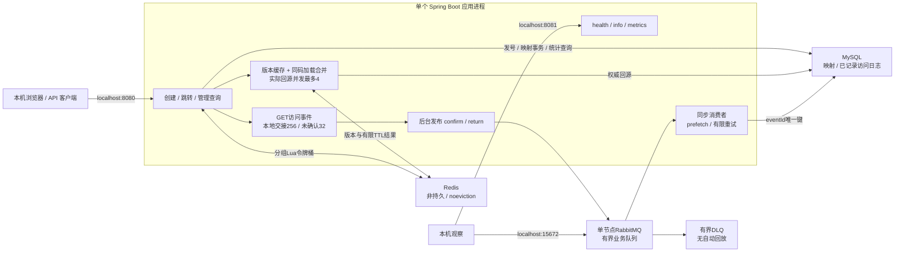

# Short Link

[项目文档导航](docs/README.md)：运行与使用、架构与设计、测试与证据及历史材料。

面向 Java 后端实习展示的单应用短链接服务：匿名创建永久/限时短链接，302 跳转，内部启禁用与最近 30 个上海统计日的 PV、UV 和访问明细。MySQL 保存权威数据，Redis 加速并限流，RabbitMQ 承接有界、best-effort 异步统计。


Java 17 · Spring Boot 3.5.16 · MyBatis-Plus 3.5.17 · MySQL 8.4.4 · Redis 7.4.2 · RabbitMQ 3.13.7 · springdoc OpenAPI。页面由同一 Spring Boot 应用提供，无独立前端构建。

## 实际架构



管理端口没有业务令牌鉴权，依靠 localhost 边界。详细职责与两个关键时序见 [架构说明](docs/architecture.md)。

## 第一次运行

准备 Java 17，以及独立配置的 MySQL、Redis 和 RabbitMQ。按 [本地配置与启动说明](docs/local-secrets.md)生成秘密、配置设施账号、导入环境变量并运行应用。页面默认位于 <http://localhost:8080/>。

## 最短演示

1. 打开 <http://localhost:8080/>，创建 `https://example.com/demo`；用 `curl.exe -I http://localhost:8080/s/<返回短码>`（Linux 用 `curl`）观察 302、Location、no-store，HEAD 不产生统计。
2. 浏览器打开生成的短链接两次，再进入 `/admin.html`，手动输入本地配置中的管理令牌；轮询统计，已记录事件为 PV=2、同一 Cookie 的 UV=1。统计异步可见，不保证立即完成。不要在截图或分享中展示秘密。
3. 管理页禁用后访问得到403，启用后恢复302；快速连续创建会遇到429及 Retry-After，等待不保证下次获准。
4. 查看 <http://localhost:8080/readyz> 与 <http://localhost:8081/actuator/health/dependencies>。完整 MQ/Redis 故障、创建拒绝和受控恢复演示由 [可重复观察入口](docs/performance-and-failures.md)说明历史故障行为。

## API、测试与证据

[本地 Swagger UI](http://localhost:8080/swagger-ui/index.html) / [API契约与错误处理](docs/api.md)：管理头、HEAD、429、各类503及创建重试边界。UI 不预填或持久保存令牌。


截图来自独立本地演示项目；Swagger 中的 2763 是拍摄时分配的隔离端口，本地默认配置使用 8080。公开页面未填写管理令牌。

```powershell
# 无设施 Java/页面回归
pwsh -NoProfile -File ops/tests/run.ps1 unit
```

Linux 等价入口 `sh ops/tests/run.sh unit`。测试需 JDK17、Python3.10+、Node18+。[测试说明](docs/testing.md) · [CI与报告](docs/ci.md) · [正式验证总入口](docs/verification.md) · [四条简历素材](docs/portfolio.md)。

## 故障与边界

Redis 故障时创建/管理在业务开始前拒绝，跳转限流放行但实际回源仍受每实例4并发保护。MySQL 已提交而缓存协调未确认的503是另一种结果：保留短码，仅恢复协调；重复POST可能新增映射。即时可见依赖同一Redis主实例及确认写入未丢失，恢复旧快照需受控清理。

MQ 故障不阻塞核心跳转；本地交接满、发布不确定或退出允许漏记，无同步回退、outbox或端到端恰好一次。PV仅计已记录事件，UV是匿名浏览器身份而非真实人数。日志保护与低基数指标见 [观测说明](docs/observability.md)，故障分组见 [健康说明](docs/health.md)。

这是本地单实例工程项目，不宣称生产抗DDoS、高可用、无条件性能提升或生产SLA。交付停止线：不增加账号、网关、微服务、事务消息、Bloom Filter、自动DLQ回放或完整监控平台。
