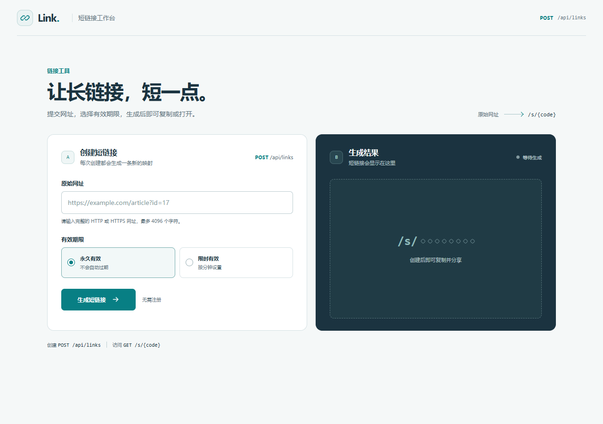
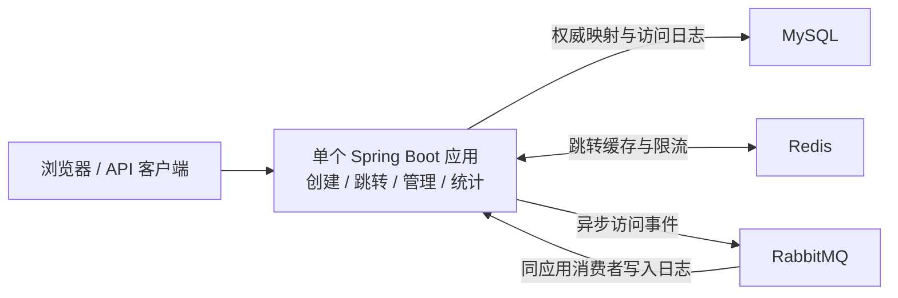
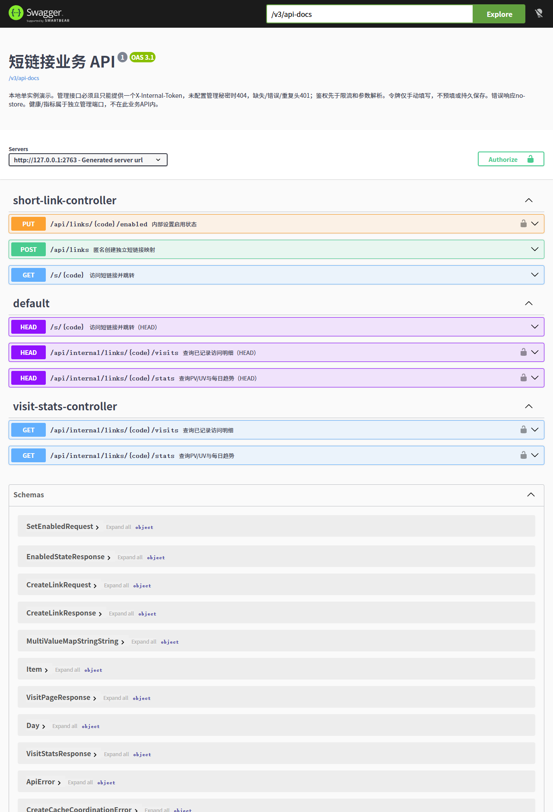

# Short Link

面向 Java 后端实习展示的单应用短链接服务：匿名创建永久/限时短链接、302 跳转、内部启禁用，以及最近 30 个上海统计日的 PV、UV 和访问明细。

Java 17 · Spring Boot 3.5.16 · MyBatis-Plus 3.5.17 · MySQL 8.4.4 · Redis 7.4.2 · RabbitMQ 3.13.7 · springdoc OpenAPI。页面由同一 Spring Boot 应用提供，无独立前端构建。



## 第一次运行

1. 在本机准备 MySQL、Redis、RabbitMQ，在 IDEA 中以 Maven 项目打开仓库，选择 JDK 17。
2. 将 [YAML 模板](config/application-local.example.yml)复制为 `config/application-local.yml`，填入本机连接信息和独立的管理令牌、访客 HMAC。首次数据库账号和 MQ 配置按[本机配置指南](docs/入门与使用/local-secrets.md)准备。
3. IDEA 运行 `LinkApplication.main`，工作目录设为项目根目录，程序参数填 `--spring.profiles.active=local`。
4. 打开 <http://localhost:8080/>。

配置直接写入本地 YAML，无需导入环境变量。以后只需启动三个本机服务，再点击 IDEA 的运行按钮；账号和队列策略不需要每次重配。

## 最短演示

1. 在首页创建 `https://example.com/demo`，浏览器打开生成的短链接两次，观察跳转。
2. 打开 <http://localhost:8080/admin.html>，输入本地 YAML 的 `short-link.internal-token`，查询该短码的统计。等待异步记录完成后，通常可观察到 PV=2、同一 Cookie 的 UV=1。
3. 在管理页禁用后访问得到 403，启用后恢复跳转。快速连续创建会遇到 429，按 Retry-After 等待后再试，等待不保证下次获准。

需要检查响应头时，运行 `curl.exe -I http://localhost:8080/s/<返回短码>`，可观察 302、Location 和 no-store；HEAD 请求不产生统计。PV 统计已记录事件，UV 表示匿名浏览器身份。

## 实际架构



缓存、消费幂等、故障隔离和关键时序见[当前架构](docs/架构与原理/architecture.md)。本项目用于本地单实例学习与展示；统计为 best-effort，故障或退出允许漏记。

## API 与测试

[本地 Swagger UI](http://localhost:8080/swagger-ui/index.html) · [API 契约](docs/入门与使用/api.md) · [测试说明](docs/测试与验证/testing.md) · [验收证据](docs/测试与验证/verification.md)。



截图中的 2763 是拍摄时使用的隔离端口，本地默认端口为 8080。以下无设施 Java/页面回归需要 JDK 17、Python 3.10+、Node.js 18+，不是日常启动的前置步骤：

```powershell
pwsh -NoProfile -File ops/tests/run.ps1 unit
```

Linux 使用 `sh ops/tests/run.sh unit`。

## 接下来读什么

[文档导航](docs/README.md)区分运行演示、面试原理和故障排查。准备面试从[面试阅读导航](docs/面试准备/README.md)进入，先练项目介绍，再选择数据库、缓存、MQ、限流与并发专题；启动失败先查[常见启动问题](docs/入门与使用/local-secrets.md#常见启动问题)。Redis 恢复、积压观察和死信排查在对应故障发生时再阅读。
