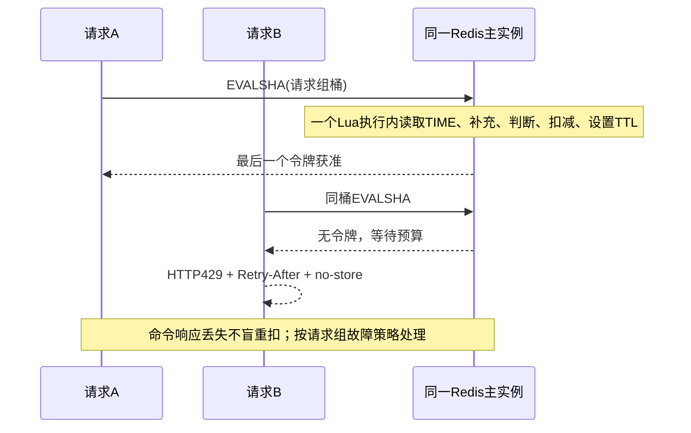
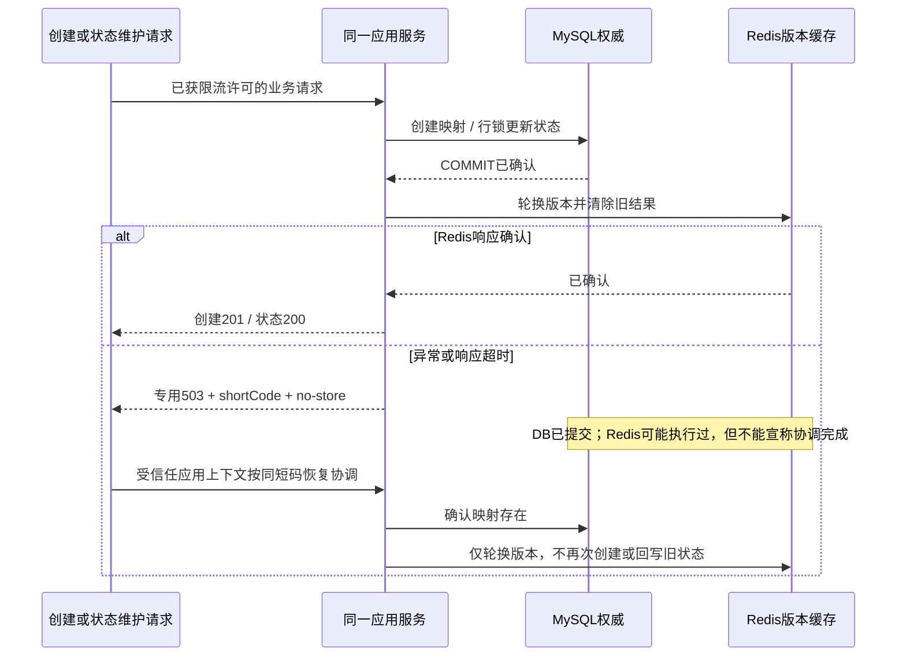

# 短链接服务代码组织

项目使用单模块 Java 17 / Spring Boot / Maven 结构。当前只有短链接这一项业务功能，因此业务包直接位于应用根包 `com.example.shortlink` 下；`LinkApplication` 留在根包，以便 Spring Boot 扫描其子包。

## 目录

```text
src/main/java/com/example/shortlink/
  LinkApplication.java
  api/                 核心 HTTP 控制器、请求响应及参数反序列化
    error/             统一错误映射与错误表示
    management/        管理标记、解析前鉴权与 MVC 装配
    stats/             逐请求采集、统计查询与明细 HTTP 表示
  configuration/       主核心 DataSource 装配
  service/             创建、状态维护、跳转与缓存协调恢复流程，以及用例结果
    error/             业务失败类型，由 api 映射为 HTTP 响应
  shortcode/           发号契约与确定性短码编码规则
  persistence/         MyBatis-Plus 映射、MySQL 发号与映射保存错误分类
  cache/               跳转缓存契约、读取状态、快照、配置与 Redis 实现
  stats/               VisitEvent、VisitRecorder、StatsDateRange 共享契约
    collection/        匿名身份、HMAC 与元数据规范化
    messaging/         发布、消费、协议、MQ 运行生命周期及框架 adapter
    persistence/       MySQL 保存确认、失败分类与写入观察
    query/             已记录事件的快照查询、游标与查询观察
    retention/         过期日志批量清理及追赶调度
    config/            统计专用池与统计配置绑定
src/main/resources/
  application.yml      数据库、Redis 和服务地址配置
  schema.sql           MySQL 表结构
  static/              由 Spring Boot 提供的单页界面
src/test/java/com/example/shortlink/
  ShortLinkApiTest.java
  RedisRedirectIntegrationTest.java
  service/             创建、状态维护、跳转、协调恢复及请求合并测试
  shortcode/           短码编码测试
  cache/               Redis 缓存行为测试
src/test/resources/
  application-test.yml
```

## 模块与依赖

`RedirectDecision` 携带原始 URL 和最终逐请求检查时冻结的时刻。`api.stats.VisitCollection`
只在正常 GET 决定后识别 Cookie、摘要和最小化元数据，将独立 `VisitEvent` 交给
`VisitRecorder`。`stats.collection` 的规范化规则也由消息 codec 校验复用；采集对
`VisitWriteObservations.collectionFailed` 保留窄引用，不读取池快照或执行写入。

`stats.messaging.AsyncVisitRecorder` 封装容量 256 的本地交接、容量 32 的未确认尝试、
confirm/return、独立观察和发布恢复。终态与许可分别一次结算；阻塞 sender 不阻止观察，
迟到 ACK 不覆盖已结算结果。reset 完成且原 sender 返回后才重开发布，仅恢复发布连接。
它不依赖 admin、listener 或应用事件。`VisitMqRuntime` 统一接收 ready、context-close 和
destroy，核心 ready 后后台声明拓扑并按消费意图启动 listener，不等待 broker 启动 HTTP。

关闭先一次性取得终止权并停止新交接，终止启动任务，再由原后台 adapter 发起发布与消费
网络清理；所有 MQ 等待共用约 2 秒预算。`VisitListenerContainer` 拒绝终止后的迟到 start，
只创建一次清理任务；`VisitConnectionFactory.stop` 不在框架调用线程执行网络 reset。
配置保留外部管理的销毁保护。重复通知不启动替代 worker；预算不等于整个进程的截止。
未发进程内事件允许丢失，未确认不等于未送达，未 ACK 消费可能重投。

`stats.persistence.MySqlVisitPersistence` 只实现 `VisitPersistence`，保留容量 2 的立即准入、
独立自动提交、仅 eventId 重复成功、保存不确定与确认后清理失败的区分。HTTP 使用异步交接，
不再暴露同步 record 入口。`VisitConsumer` 使用 AUTO ACK，同步确认保存、事件重复或合法超窗
后返回；暂时、繁忙与不确定错误最多三次尝试，200/500ms 等待，每次重查窗口，最终拒绝不 requeue。

`configuration.CoreDataSourceConfiguration` 声明原 `dataSource`、@Primary 和 Hikari 绑定，
核心 Mapper、发号、JdbcTemplate、事务与 schema 初始化使用主池。
`stats.config.StatsDataSourceConfiguration` 只声明原 `statsDataSource`：容量 4、minimumIdle=0、
懒初始化与原超时不变；写入/查询/清理准入分别 2/1/1。两池共享 MySQL，资源配额隔离不等于硬件隔离。

管理标记和解析前鉴权位于 `api.management`，只依赖 `api.error.ApiError` 表示拒绝结果。
错误 handler 与三种错误表示共同位于 `api.error`；根包核心控制器和 `api.stats` 单向引用管理标记。
未配置关闭、精确令牌比较、GET/隐式 HEAD 和解析前拒绝保持；令牌不进入用例。

统计查询 HTTP 位于 `api.stats`，共享 `StatsDateRange` 固定上海窗口，`stats.query.MySqlVisitStatsQuery`
通过专用池和容量 1 的准入，在同一只读 REPEATABLE READ 快照中读取映射、汇总、趋势与身份版本。
明细按发生时刻和行 ID 倒序，游标绑定短码和日期范围；查询失败不会伪造零访问。
`stats.retention` 保留每批独立提交、轮次预算、启动/每日/积压追赶，停采不停止历史消费、查询或清理。
详见 [采集说明](visit-collection.md)、[异步设计](async-visit-statistics.md)、[查询说明](visit-statistics-query.md)。

`ShortLinkStateService` 承担状态维护用例。入口挂起调用者事务，在独立事务中通过 Mapper 的行锁读取当前映射，获取锁后检查有效期和重复目标，再仅更新 enabled；独立事务确认提交后才轮换缓存版本。缓存同步失败在当前请求内最多尝试三次，等待 50/100ms，耗尽或等待中断报告专用部分完成错误；时间等待通过包级构造器的可控依赖进行测试。该用例复用现有 Mapper、Clock 和 RedirectCache，不新增通用仓储或后台任务。详见 [ADR-0005](adr/0005-enabled-state-api.md)。

`ShortLinkCreationService` 承担完整创建用例：URL 与有效时长校验、发号编码、短码冲突重试、提交后的缓存协调和内部协调恢复。`RedirectService` 承担完整跳转用例：短码格式校验、缓存回退、跳转拒绝判定、版本条件回填、实例内加载合并与逐请求到期复查。`api` 直接调用对应服务，把结果或错误转换为 HTTP 响应；没有保留纯转发的旧 façade，请求 DTO 不作为数据库记录使用。

`service` 保留流程编排和 `CreatedShortLink` 这一创建用例的结果。它不包含 HTTP 请求与响应 DTO、缓存协议类型或短码编码实现。`CreatedShortLink` 只包含短码与到期时间，由控制器转换为包含完整短链接的 `CreateLinkResponse`；不为单个用例结果额外建立 `model` 包。

创建服务通过构造函数接收 Mapper、`persistence/MySqlShortLinkWriter`、`shortcode/ShortCodeIdIssuer`、`shortcode/PermutedShortCodeEncoder`、`cache/RedirectCache` 和 `Clock`；跳转服务只接收 Mapper、缓存、Clock 和已有等待预算配置。发号契约与编码规则归属 `shortcode`；实际执行 JDBC 的 `MySqlShortCodeIdIssuer` 留在 `persistence`。`RedirectCache`、`RedirectCacheRead` 与 `RedirectCacheEntry` 同归 `cache`，`RedisRedirectCache` 提供生产实现，封装 Lua、序列化与 TTL。测试仍可在原有发号和缓存接缝上替换实现，无需新增接口或兼容类。

`MySqlShortLinkWriter` 集中插入确认和 MySQL 1062／PRIMARY 错误分类，只将短码主键冲突翻译为 `ShortCodeCollisionException`；其他唯一约束和数据库失败原样传播。创建服务决定重新发号重试一次，数据库知识不进入用例。该 adapter 不提供通用 CRUD。`ShortLinkMapper` 和带表字段注解的 `ShortLinkEntity` 仍由 MyBatis-Plus 管理；当前只有一张映射表，不增加透传的仓储接口或一套对应的纯领域实体。

生产代码的包依赖方向为：

```text
api         -> service、service.error
service     -> cache、persistence、shortcode、service.error
persistence -> shortcode
```

`cache` 不依赖 `service` 或 `persistence`，`shortcode` 不依赖业务流程或数据库实现，因此没有跨包循环。业务编排依赖缓存契约，不直接操作 Redis 实现；数据库实现也不反向调用业务编排或 HTTP 入口。`service` 仍使用数据库实体、Mapper 和缓存结果状态，这是当前项目接受的实现耦合，不将它描述为纯领域层。

`service/error` 中的异常表达创建或跳转失败的原因。`api/error/ApiExceptionHandler` 把普通错误映射成 `ApiError`；已提交创建的缓存协调未确认则使用带短码的 `CreateCacheCoordinationError`，业务流程无需知道 HTTP 状态码。短码编码规则由 `PermutedShortCodeEncoder` 封装，创建流程只调用 `encode`。

创建时先由 MySQL 分配 ID，再编码并插入映射；发号与映射分别提交。Spring 管理的创建入口挂起调用者事务，让 MyBatis 的非事务插入在返回时已提交。随后轮换 Redis 版本并清除旧结果，确认成功才返回创建完成；协调异常保留已提交短码并报告部分完成。受信任维护代码可调用 `recoverCacheCoordination` 按原短码仅重试缓存协调，不重新写库。

跳转在读取缓存前校验短码格式，再读取带版本的 Redis 条目。缓存 miss 或有限期占位都会继续查询 MySQL；可跳转、不存在、已过期和已禁用结果命中时使用相应快照。每次使用快照仍检查业务到期时间，保持过期优先于禁用的顺序。MySQL 成功查询后的四类结果只按读取时的版本条件回填；数据库查询错误不写成跳转拒绝结果。

Redis 使用 `shortlink:redirect:v2:` 命名空间，结果与版本占位都有有限 TTL。正值、不存在、已过期与已禁用结果各按配置上限写入，并向下抖动 0%～10%；限时正值的 TTL 还受业务剩余有效时长限制。命中不续期，缓存 TTL 不代替业务到期判断。Redis 不可用时回源 MySQL，没有拿到版本就跳过条件回填。

每个 `RedirectService` 实例按“短码＋缓存版本”共享正在进行的数据库加载，成功或失败后清理任务。不同短码或不同版本可以并行；版本无法确认时独立回源，不加入旧任务。等待共享任务的预算默认 200ms，超时后重读一次缓存，仍未命中则独立查询，不取消其他请求正在使用的任务。各请求在使用共享结果时再次检查业务到期时间。该机制允许多个实例各回源一次，也允许超时后的额外查询，不是全局互斥或 HTTP 总耗时保证。

创建、维护和恢复协调仍遵守数据库提交后轮换缓存版本的协议；即时可见依赖所有实例使用同一协议、同一 Redis 主实例且已确认更新未丢失。重启、切换或恢复旧快照时须按 [Redis 受控恢复说明](redis-recovery.md) 清理旧结果与版本。具体规则和一致性范围见 [ADR-0002](adr/0002-permuted-auto-id-base62.md)、[ADR-0003](adr/0003-redis-cache-aside-for-redirects.md) 与 [ADR-0004](adr/0004-negative-cache-for-redirects.md)。

测试目录与生产包对应。HTTP 和 MySQL/Redis 集成测试位于测试根包，覆盖接口可见行为；`service` 测试覆盖创建、恢复协调和并发加载，`shortcode` 测试覆盖固定编码向量及长度边界，`cache` 测试覆盖 TTL 和缓存开关。`RedirectCachePropertiesTest` 验证配置绑定及启动失败；`RedisRedirectCacheTest` 与实现保持同包，以使用包级可见的可控随机源构造器。运行方式见 [README](../README.md)。

## 统计依赖与验收导航

消息、查询和清理共享事件/日期规则，但不互相调用；消息依赖持久化，持久化/查询/清理
依赖统计配置，codec 复用 collection 规范化。HTTP 调用 collection、query、共享契约和统计配置；
数据、缓存与编码实现不依赖 HTTP。包依赖已包含实际配置引用，不把 service 描述为纯领域层。
没有新增透传 façade、通用 repository、空功能包或因搬包机械公开的辅助 implementation。

同包测试跟随 messaging、persistence、retention、config、api.management 和 api.stats 实现。
根包保留 HTTP 与设施集成验收。消息故障测试操作内部发布启动/关闭；应用生命周期验收驱动
VisitMqRuntime 或真实 Spring context，手工装配也注册 runtime。核心配置测试额外验证只有主池时的
JdbcTemplate、事务和 Hikari 绑定；真实设施测试继续验证 Mapper/发号、SQL 初始化、消费者重投与去重。

实施结果与各类验证见 [架构优化验收](../.scratch/architecture-optimization/verification.md)。
单模块内职责调整不改变 schema、缓存格式、消息版本、HTTP 或配置键，不承诺性能和可靠性提升。
需要回退时按提交依赖逆序回退，保留框架销毁保护，不通过调大等待或跳过设施测试规避失败。

## 已有缓存配置与维护操作

`RedirectCacheProperties` 通过 `@ConfigurationProperties("short-link.redirect-cache")` 集中绑定，启动时校验。原配置键与 application.yml 中的环境变量占位保持不变：默认启用，正值／已过期 TTL 上限各 5 分钟，不存在 30 秒，已禁用 15 秒，加载等待预算 200ms。时长显式空值、非法格式、非正值或转换溢出都会导致启动失败；TTL 至少能表示为 1 毫秒，等待预算至少能表示为 1 纳秒。Redis adapter 与跳转用例各自只取得所需的配置值。

已核对所有生产引用和受信任维护说明：`deleteIfVersion` 没有调用或独立维护用途，已删除 interface 操作、Lua 和对应测试桩。维护完成仍通过 `ShortLinkCreationService.recoverCacheCoordination` 轮换版本，而不是手工删除。坏值按原值条件删除的 Redis 私有操作继续保留，用于避免删除并发写入的新值。

这两个用例集中各自的复杂规则；删除创建用例会把验证、重试和完成状态散回 HTTP，删除跳转用例会把并发与版本规则散回调用方。持久化保存 adapter 集中数据库特有分类，缓存 adapter 保留协议深度；已有发号、缓存和 Clock seam 继续支持测试与复用。


## 最终工程职责与关键时序

`ratelimit`封装四请求组共享的Redis Lua令牌桶；`api`拦截器在发号/业务前执行，管理鉴权更早。`RedirectService`实际SQL由每实例并发许可保护，缓存命中与共享等待不占许可。`observability`提供安全健康、固定类别指标与请求上下文；`logging`约束控制台业务/Redis/JDBC/AMQP/HTTP框架危险日志。业务OpenAPI由`openapi`装配，不包含管理端口Actuator。完整运行边界见[首页架构图](../README.md)、[API](api.md)、[健康](health.md)和[观测清单](observability.md)。



Lua原子性只覆盖Redis桶操作；不覆盖MySQL事务，后续业务失败不退令牌，Redis重建额度可重置。桶按连接对端或固定管理分组，不按短码/令牌身份。



状态维护的请求内协调最多三次；创建不通过重POST恢复。普通数据库失败/提交未确认不能宣称已保存；业务前`RATE_LIMIT_UNAVAILABLE`和`REDIRECT_LOAD_BUSY`不属于上述已提交503。[完整恢复规则](redis-recovery.md)仍适用。
