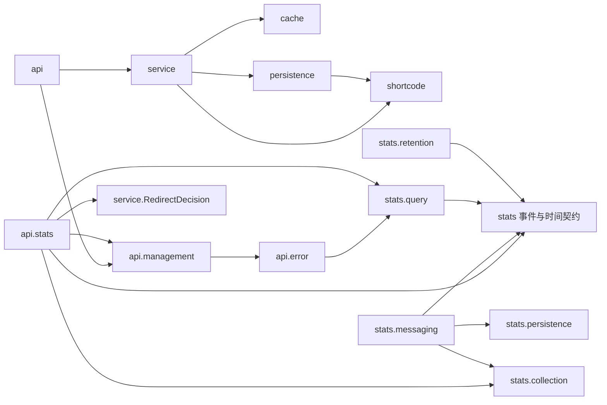
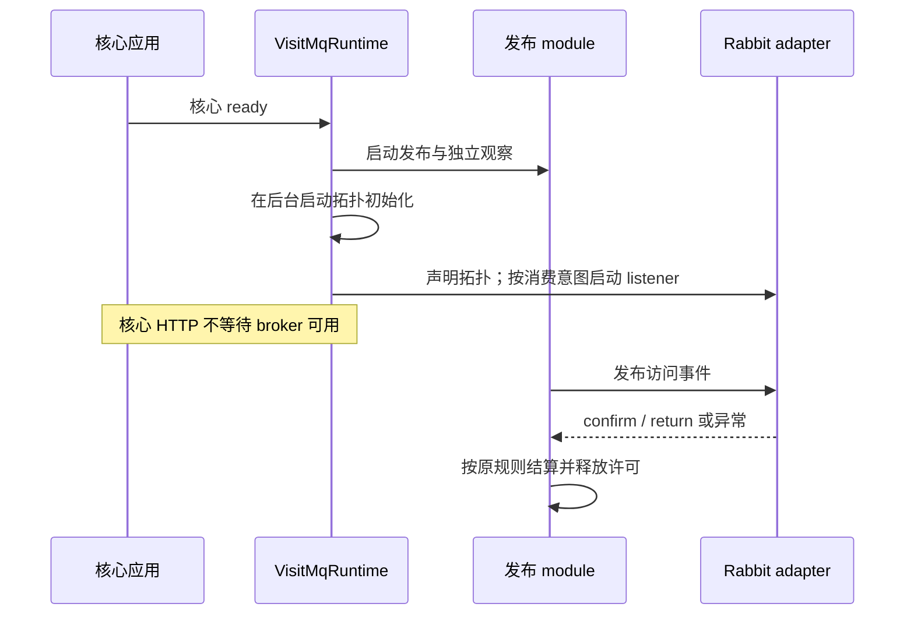

# Link 项目架构优化完整方案

> **历史方案，已实施。** 当前目录和职责见 [实际架构](../架构与原理/architecture.md)，实施与验收见 [架构优化验证](../../.scratch/architecture-optimization/verification.md)，后续完整版本验收见 [正式验证](../测试与验证/verification.md)。以下正文保留 2026-10-03 设计时点的原始内容；“尚未实施”、文件数量及迁移路径均对应当时基线，不代表当前状态。

日期：2026-10-03  
评估基线：`e9dd03d4980f624c4d0f04cf97b815ae8f3124aa`  
文档状态：方案，尚未实施。本文描述目标结构与迁移验收，不替代当前架构说明或已有 ADR。

## 1. 方案结论与范围

采用单 Maven module 内的渐进整理：保持短链接核心用例的完整封装，将访问统计内部按实际职责分组，集中 RabbitMQ 运行生命周期的决策，把核心数据库装配归到应用配置，并收敛同步统计遗留入口。

当前有 74 个生产 Java 文件，其中 `stats` 27 个、`api` 20 个；有 33 个测试类文件。静态项目内 import 检查未发现包级循环，但这个结论不覆盖 Spring 生命周期、SQL 表访问和共享资源。主要问题是运行职责和实现知识分散，而非循环依赖或所有类都过大。

本方案覆盖：

- 生产目录、完整文件归属、类职责、依赖方向和可见性。
- 发布、消费、连接与线程的资源所有权，以及启动、恢复、关停协议。
- 创建、跳转、启禁用、统计查询、清理和前端的保留与整理策略。
- 配置、错误、观察、测试和文档迁移。
- 分步提交、验收条件及回退方式。

架构词汇沿用指定技能：module 是具有 interface 的模块；interface 包含调用承诺、顺序和失败语义；implementation 是内部实现；seam 是可替换位置；adapter 是 seam 上的实现；depth 是少量调用知识封装大量行为；locality 表示变更集中；leverage 表示调用者获得的收益。类行数不用于判断 depth。

## 2. 必须保持的业务与设施约束

| 约束 | 优化后的要求 | 已有依据 |
| --- | --- | --- |
| 短码与映射 | 4～8 位大小写敏感 Base62；发号、编码、保存和冲突重试语义保持 | ADR-0002 |
| 创建提交 | 发号与映射分别提交；缓存协调在映射提交确认之后；部分完成响应携带已保存短码 | ADR-0002、0004 |
| 跳转拒绝结果 | 不存在、已过期、已禁用保持区分；过期优先于禁用 | ADR-0004 |
| 缓存 | 同版本条件回填、有限 TTL、实例内按短码与版本共享加载；逐请求复查到期 | ADR-0004 |
| 启禁用 | 行锁后读取时钟；重复状态拒绝；提交后协调最多三次，等待 50/100ms | ADR-0005 |
| 内部管理 | 管理保护先于参数与请求体解析；未配置关闭；GET、HEAD 和状态 PUT 同样保护 | ADR-0006 |
| 访问事件 | 只在正常 GET 跳转决定后逐请求冻结；HEAD 和跳转拒绝结果不采集 | CONTEXT.md、ADR-0006/7 |
| 采集 | HTTP 只做有界本地交接，不等待统计网络或 JDBC；失败允许漏记且保持跳转 | ADR-0007 |
| 消费 | 保存确认或仅 eventId 重复允许正常 ACK；暂时失败最多三次；最终拒绝不 requeue | ADR-0007 |
| 统计权威 | MySQL 已记录访问日志；范围 UV 对整个范围去重；聚合在同一读取快照中完成 | CONTEXT.md、ADR-0006 |
| 时间与保留 | 上海统计日，包含当天的最近 30 日；每次消费重试前重新检查窗口 | CONTEXT.md、ADR-0006/7 |
| 运行隔离 | 发布与消费连接分离；MQ 在核心启动后后台初始化；只恢复发布连接 | ADR-0007 |
| 开关 | 关闭采集只阻止新事件/Cookie；消费、历史查询、日志清理继续 | ADR-0007 |
| 停机 | 停止新交接，有限等待；进程内待发允许丢失；未确认不等于未送达 | ADR-0007 |

方案不改变现有表结构、缓存格式、消息字段与 schemaVersion、HTTP 路径、响应字段、错误码、配置键、broker 拓扑和 policy。不引入新的可靠记账承诺。以上是行为兼容的验收约束，不是仅靠搬文件就能证明的结果。

## 3. 目标目录骨架

```text
src/main/java/com/example/shortlink/
  LinkApplication.java
  configuration/
    CoreDataSourceConfiguration.java       新增：从现有统计配置迁出核心池定义
  api/
    ShortLinkController.java
    [创建、启禁用请求响应与反序列化]
    error/
      ApiExceptionHandler.java
      ApiError.java
      CreateCacheCoordinationError.java
      StateCacheCoordinationError.java
    management/
      InternalManagement.java
      InternalManagementAccess.java
      InternalManagementWebConfiguration.java
    stats/
      VisitCollection.java
      VisitStatsController.java
      VisitStatsResponse.java
      VisitPageResponse.java
      StatsDateParameters.java
      VisitCursorCodec.java
  service/
    ShortLinkCreationService.java
    ShortLinkStateService.java
    RedirectService.java
    CreatedShortLink.java
    RedirectDecision.java
    error/
      [现有业务失败类型]
  shortcode/
    ShortCodeIdIssuer.java
    PermutedShortCodeEncoder.java
  persistence/
    [短链接映射、Mapper、MySQL 发号与保存实现]
  cache/
    [现有缓存 interface、协议类型、配置与 Redis adapter]
  stats/
    VisitEvent.java                        跨统计 module 的冻结事件
    VisitRecorder.java                     HTTP 本地交接 seam
    StatsDateRange.java                    现有共享时间规则与请求范围
    collection/
      VisitIdentity.java
      VisitMetadata.java
    messaging/
      AsyncVisitRecorder.java
      VisitMqRuntime.java                  新增：运行生命周期决策
      VisitConsumer.java
      VisitMessageCodec.java
      VisitRabbitConfiguration.java
      VisitRabbitProperties.java
      VisitConnectionFactory.java
      VisitListenerContainer.java
    persistence/
      VisitPersistence.java
      VisitPersistenceException.java
      MySqlVisitPersistence.java            由 MySqlVisitRecorder 重命名并收窄
      VisitWriteObservations.java
    query/
      MySqlVisitStatsQuery.java
      VisitStatsResult.java
      VisitPageResult.java
      VisitCursor.java
      StatsQueryException.java
      VisitQueryObservations.java
    retention/
      VisitLogCleanup.java
      VisitCleanupSchedule.java
      VisitCleanupConfiguration.java
    config/
      VisitStatsProperties.java
      StatsDataSourceConfiguration.java    仅保留统计池定义
  logging/
    SafeDependencyConsoleEncoder.java

src/main/resources/
  application.yml
  schema.sql
  logback-spring.xml
  static/
    index.html
    app.js
    styles.css

src/test/java/com/example/shortlink/
  [HTTP 与真实设施验收测试保留根包]
  api/management/                          管理配置测试
  api/stats/                               采集失败测试
  service/                                核心用例测试
  shortcode/                              编码测试
  cache/                                  缓存测试
  stats/messaging/                         codec、消费与生命周期测试
  stats/persistence/                       写入观察测试
  stats/retention/                         清理及计划测试
  stats/config/                           配置装配测试
  logging/                                日志输出测试
```

保持现有核心包名，是因为它们已经围绕完整用例与真实设施形成可读的结构。`stats` 已长出多个独立变化的能力，因此细分它的内部目录。只创建有实际代码的包。

`StatsDateRange` 留在统计根包：当前消费、清理、调度和 HTTP 日期解析都复用它的上海时区与窗口起点。直接把它移入 query 会让消费和清理依赖查询实现。此轮保留现有共享类型，不为常量与两行日期计算增加一个新时间 interface。

`VisitWriteObservations` 与 MySQL 写入实现同包，保留包级写入记录方法。HTTP 的 `VisitCollection` 暂时仍通过它记录 COLLECTION 类别：这是明确保留的窄依赖，仅调用 `collectionFailed()`，不调用连接池快照或写入方法。暂不为一个计数器新增观察 interface；未来采集指标与写入指标出现独立变化时再分离。

## 4. module 职责与依赖规则

| module | 唯一主要责任 | 调用者应该知道的 interface | 留在内部的 implementation |
| --- | --- | --- | --- |
| api | HTTP 输入输出与错误表示 | 路径、参数、响应与错误语义 | DTO、表示转换、反序列化 |
| api.error | 统一 HTTP 错误表示 | 既有状态码、错误码与响应字段 | 普通错误与部分完成结果的映射 |
| api.management | 内部管理请求准入 | 标记受保护入口 | 令牌读取、比较、拒绝响应与拦截顺序 |
| api.stats | 统计的 HTTP adapter | 逐请求采集入口、统计与明细表示 | Cookie、请求元数据提取、日期与游标编码 |
| service | 完整短链接用例 | 创建、启禁用、跳转及内部协调恢复 | 事务顺序、缓存协调、碰撞重试、共享加载 |
| shortcode | 短码编码与发号契约 | 正整数发号与确定性编码规则 | 有界双射与 Base62 |
| persistence | 短链接的 MySQL adapter | 发号与保存确认、Mapper 行为 | SQL、实体映射、数据库冲突分类 |
| cache | 跳转缓存协议 | 读取状态、版本轮换、条件回填 | Lua、JSON、TTL 与损坏值处理 |
| stats.collection | 匿名访客身份与元数据规范 | 身份结果与最小化规则 | HMAC、Cookie 值规范、网段与来源规范化 |
| stats.messaging | 有界交接、发布与消息消费 | VisitRecorder；消息消费决定 | confirm/return、恢复门、Rabbit adapter 与运行生命周期 |
| stats.persistence | 访问日志持久化确认 | VisitPersistence 的保存/重复/失败承诺 | SQL、唯一键分类、准入与不确定结果处理 |
| stats.query | 已记录访问事件查询 | 聚合与明细的查询结果 | SQL、单次一致快照、游标位置、准入与超时分类 |
| stats.retention | 过期日志维护 | 运行一轮、积压观察与追赶需求 | 独立批量提交、轮次预算、启动/每日/追赶计划 |
| configuration / stats.config | 应用资源装配 | 固定 Bean 名与配置归属 | 核心池、统计池与属性绑定 |

目标依赖关系如下；图省略配置装配以及现有异常类型引用。



依赖约束：

1. HTTP 类型只在 `api` 出现；缓存、发号、持久化和消息事件不得保存请求对象或 DTO。
2. 核心用例不直接依赖 `RedisRedirectCache`、RabbitTemplate、listener 或统计写入实现。
3. messaging 不调用 query/retention；query 和 retention 不反向依赖 messaging。
4. 消费者只通过 VisitPersistence 取得明确持久化结果，不根据 HTTP、缓存或映射当前状态重新定义访问事件。
5. cache 和 shortcode 不反向依赖核心用例或 HTTP。
6. 持久化 adapter 不反向调用 HTTP；统计查询继续用统计池读取映射存在性，不能改用核心 Mapper 而破坏池隔离与一致快照。
7. service 对 Mapper/Entity 的依赖继续保留。这是本项目接受的实现耦合，不把它宣称为纯领域模型。
8. stats 对 `service.error.InvalidRequestException` 和 `LinkNotFoundException` 的现有引用暂保留；不增加透传异常翻译。没有独立调用需求时，复制一套异常类型的 leverage 不足。
9. api.stats 对 VisitWriteObservations 的窄依赖，以及 api 对 stats.config 的配置读取，是本轮显式允许的引用；不要为了依赖图整齐增加 façade。
10. 检查 import、全限定名和装配引用；仅查 import 不足以覆盖 ApiExceptionHandler 等全限定名使用。

错误表示独立归入 api.error 是为避免实际包循环：api 的控制器引用管理标记，api.management 的鉴权拒绝使用 ApiError，因此 ApiError 不能继续放在 api 根包。把四个相关错误类型集中后，方向为 api / api.stats → api.management → api.error；api.error 只依赖既有业务/统计错误，不能反向依赖控制器、鉴权或 HTTP 参数解析器。

跨包实际使用的契约、结果和 Spring 注入类型可 public。辅助解析器、框架 adapter、发布状态与可控构造器保持 package-private 或 private。搬包时不能批量改成 public 来消除编译错误。

## 5. 重点类的具体处理

| 类 | 操作 | 原因与目标 |
| --- | --- | --- |
| AsyncVisitRecorder | 收窄职责、搬至 messaging | 仅负责本地交接、发布、确认观察和发布恢复；移出 admin、listener、应用生命周期事件及拓扑启动线程 |
| VisitMqRuntime | 新增具体内部 module | 汇集 MQ 应用启动与终止决策、消费者启动意图、统一停机顺序；不新增对外消息平台 interface |
| VisitRabbitConfiguration | 搬包并整理装配 | 继续声明拓扑、连接与执行器；集中生命周期 adapter 的装配知识；Bean 名销毁保护必须有明确注释与测试 |
| VisitConnectionFactory | 保留内部 adapter | 框架 stop 不做同步网络 reset；删除会重新暴露停机阻塞风险 |
| VisitListenerContainer | 保留内部 adapter | 承担消费者异步终止与一次性完成；由 runtime 决定何时执行 |
| MySqlVisitRecorder | 重命名为 MySqlVisitPersistence | 仅实现 VisitPersistence；迁移直接调用 record 的测试后删除吞失败的同步采集适配 |
| VisitRecorder / VisitPersistence | 保留两个 seam | 本地 best-effort 交接与持久化确认具有不同承诺，不能合并 |
| StatsDataSourceConfiguration | 收窄为统计池配置 | 核心 dataSource 定义迁至 CoreDataSourceConfiguration；保留所有池配置语义 |
| ShortLinkCreationService | 保留完整用例 | URL/有效时长、发号、保存、冲突重试与提交后协调形成一个创建承诺 |
| ShortLinkStateService | 保留完整用例 | 行锁、到期和重复检查、一次更新与三次协调共同保证启禁用语义 |
| RedirectService | 保留完整用例，收敛便利入口 | 逐请求到期复查、版本共享与回填不能散到调用者；测试统一调用 decide 后删除 findOriginalUrl |
| RedisRedirectCache | 保留协议封装 | Lua、版本、TTL 与 JSON 是同一个缓存 adapter 的真实 depth |
| VisitCollection | 搬至 api.stats，保留完整采集 | 逐请求 Cookie、身份、最小化、冻结和交接组成一项 HTTP 采集职责 |
| VisitConsumer | 搬包并整理排版 | 解码、窗口检查、重试与 ACK/拒绝结果仍在一起；不按每一步拆小类 |
| MySqlVisitStatsQuery | 搬包，保留查询实现 | 统计与明细共享同一 read 约束；映射存在性与聚合快照不能拆散 |
| VisitMessageCodec | 搬包，保留严格契约 | 与采集共享 VisitMetadata 规则，避免复制规范化逻辑 |
| VisitLogCleanup / VisitCleanupSchedule | 保留职责分离，搬至 retention | 前者控制维护轮次，后者控制调度；两者已有合理 seam |
| ShortLinkController / VisitStatsController | 保留当前类，整理归属 | 路由方法数量少、主要做表示转换；此轮拆成多个薄控制器收益有限 |
| ApiExceptionHandler 及三个错误表示类型 | 一起搬至 api.error，保留统一表示 | 避免鉴权与根包控制器循环；更新异常引用，响应语义保持 |

deletion test 的应用：删除旧 MySQL record 适配与 findOriginalUrl 不会把业务规则散回生产调用者；删除 persist、decide、缓存协议或消费决定则会。因此前两者收敛，后几者保留 depth。新增 runtime 应吸收完整生命周期规则，不能只是逐项调用别人而保留原有分散所有权。

### 6.1 逻辑所有权与执行职责

只有 VisitMqRuntime 接收应用级 ready、context-close 和 destroy 通知，并保证重复通知幂等。AsyncVisitRecorder 不再知道消费者或拓扑声明。

runtime 是启动和终止的逻辑决策位置；执行网络清理仍由已有发布清理 worker 与消费者 adapter 完成。集中所有权不等于把网络 destroy 移到 Spring 关闭调用线程。

| 资源或动作 | 决策归属 | 执行归属 | 关键约束 |
| --- | --- | --- | --- |
| MQ 拓扑初始化 | runtime | 后台 startup worker + RabbitAdmin | 核心 ready 后执行，失败有界间隔继续；不阻塞核心启动 |
| 消费者启动 | runtime | VisitListenerContainer | 尊重 consumer-enabled 和终止意图，不被发布恢复隐式重启 |
| 本地新交接 | 发布 module | AsyncVisitRecorder 准入锁与有限队列 | record 不执行统计网络操作 |
| 发布 sender / observer / cleanup | 发布 module | 发布内部 worker | 观察与清理不得依赖卡住的 sender |
| 发布连接恢复 | 发布 module | cleanup worker | 只 reset 发布连接；保留恢复门与 sender 返回条件 |
| 发布连接终止 | runtime 发起 | 发布 cleanup worker | 只发起一次；Spring 不再同步调用该连接的 destroy |
| 消费连接终止 | runtime 发起 | listener 的异步 closer | 停止消费并终止连接，未 ACK 仍可能重投 |
| framework / listener 执行器 | Spring 配置装配 | 现有非阻塞 shutdownNow | 保留明确 Bean 依赖与终止顺序，不能在关闭时创建替代 worker |
| 统计 DataSource | Spring 配置装配 | DataSource 既有关闭流程 | 不随采集开关或发布恢复关闭 |

发布 module 内仍保留当前 admissionLock、recoveryLock、终态结算与许可释放的必要同步。不要将这些内部状态公开，也不把状态机拆成观察、恢复、发送各一个相互通知的公开 module。

### 6.2 启动与恢复



- 原有本地接收/满、年龄过期、未确认限额、发送失败、return、ACK、NACK 和 unknown 分类保持。
- 一个 Attempt 的终态只结算一次，许可也只释放一次；终态结算与资源退休是不同动作，不合并两个原子控制。
- 超时或错误关闭发布恢复门；reset 完成且原 sender 已返回后才重新开放，防止仍阻塞的发送与新发送交叠。
- 观察 worker 可以在 sender 卡住时结算 unknown；迟到 ACK 不覆盖终态。
- startup 失败只影响 MQ 后台动作；静态非法配置继续启动失败。
- consumer-enabled 表示消费意图，采集 enabled 表示是否生成新事件，两者独立。
- 发布恢复不触碰消费连接、暂停意图、历史查询或清理。
- startup、恢复和关闭任务的提交仍有单次/在途门控；不能通过周期性提交任务引入无界积压。

### 6.3 关停顺序

1. runtime 取得一次性终止权；终止意图不可重新开放。
2. 先通过发布准入锁停止新交接。与关闭交叠的 record 不能在队列清空后新增待发事件。
3. 停止后台 startup，保证无法晚到地重新启动消费者；保留 listener 自身的 closing 检查。
4. 发布 module 清理待发计数，将未确认 Attempt 按原规则结算并退休，停止 sender 和 observer，保留必要的异步清理执行机会。
5. 发起消费者异步终止，以及发布连接的异步终止。网络 reset/destroy 不在 context.close 调用线程同步等待。
6. 发布清理可能仍排在阻塞 reset 后面；因此等待只受共享截止时间约束，不假定排队后的 destroy 必然完成。
7. 在同一个约 2 秒的 MQ 应用级等待预算内等待已有 worker 与消费关闭回调，耗尽后返回。不得给每个 worker 各加 2 秒形成叠加等待。
8. 重复 context-close/destroy 不重复提交任务，不重复释放许可，不新建 worker；中断时保留中断标记。

这一预算只描述本 module 的有限等待，不承诺整个 Spring 进程或任意设施销毁具有统一墙钟截止。该限制与现有运行文档一致。

### 6.4 框架销毁保护

现有 externally-managed destroy hook、VisitConnectionFactory 与 VisitListenerContainer 是为真实关停语义存在的 adapter，不应在搬包时顺手删除。

把相关配置、Bean 名和注释集中在 messaging。迁移后必须用真实 Spring context-close 证明生命周期 stop 不执行同步网络 reset、连接 destroy 不被框架再次调用、framework 执行器关闭后不触发替代 worker。只有这些证据成立，才允许后续简化保护实现。

### 7.1 访问日志持久化

MySqlVisitPersistence 保留现有实现语义：

- 容量 2 的立即准入，每次获准写入独立自动提交，任何结果都释放许可。
- 仅 `uq_visit_event` 的重复归为 DUPLICATE；其他唯一约束不能被消费成功 ACK。
- 执行确认丢失归为不确定；不声称数据库一定没有保存。
- 保存已经确认后，连接/语句清理失败不能将结果翻成失败。
- 受控失败分类传给 VisitConsumer；consumer 按当前规则决定重试与拒绝。
- 删除的 record 吞异常适配由测试改用 persist 的异常断言替代，不能用泛化 try/catch 掩盖错误。

HTTP 的 VisitRecorder 只剩异步生产 adapter 后，可移除用于双实现选择的 @Primary；先核对测试替换 Bean，再做这一步。重命名后核对原默认 Bean 名的测试/维护引用；生产未发现显式旧名称依赖，不增加无用途的兼容类。

### 7.2 双连接池装配

CoreDataSourceConfiguration 接收现有 DataSourceProperties，声明原 `dataSource`、@Primary 与 `spring.datasource.hikari` 绑定。StatsDataSourceConfiguration 继续声明原 `statsDataSource` 并绑定 VisitStatsProperties。

保留 MyBatis、JdbcTemplate、发号、事务管理器和 SQL 初始化的核心池归属；统计 writer/query/cleanup 继续显式引用 statsDataSource。不要为目录整理改库地址、凭据、Bean 名或事务策略。

| 资源 | 当前起点，优化后保留 |
| --- | --- |
| 统计池总容量 | 4；minimumIdle=0；初始化不要求连接成功 |
| 写入 / 查询 / 清理准入 | 2 / 1 / 1，立即尝试 |
| 统计取连接 / 验证 | 1000ms / 500ms |
| 网络建连 / socket | 500ms / 1000ms |
| SQL / 行锁等待 | 1 秒 / 1 秒，仅统计连接 |
| 发布缓冲 / 未确认 | 256 / 32 |
| 发布本地年龄 / 确认观察 | 各 5 秒，仍不是网络发布统一截止 |
| 发布 channel / 获取等待 | 16 / 200ms |
| 消费 concurrency / prefetch / batch | 1 / 10 / 1 |
| 消费重试 | 首次加两次，间隔 200/500ms |
| 业务队列 policy | ready 10000 或 16MiB；24h TTL；reject-publish |
| DLQ policy | 1000 或 4MiB；24h TTL；drop-head，无自动回流 |

broker policy 的实际权威文件继续是 `ops/visit-consumer-policies.json`。容量整理不附带调参，也不据此宣称性能提升。

### 7.3 时间规则与查询

保留 StatsDateRange 的请求固定 today、上海日期区间与 UTC 左闭右开时刻范围。消费每次重试从 Clock 重新确定当前保留窗口；冻结的 occurredAt/statDate 不改写。清理每轮使用保留截止日，查询主动过滤范围外日志。

查询继续把映射存在性、汇总、日趋势和身份版本放在同一个 REPEATABLE READ 快照；分页继续按 occurred_at/id 降序，并通过游标绑定短码与日期范围。分页之间不承诺同一快照，generatedAt 不变成消费水位。

不能以“查询解耦”为由单独查询映射再开第二个连接聚合，也不能让消费按映射当前 enabled/expiresAt 重判旧事件。

### 7.4 错误和观察

业务失败仍由 ApiExceptionHandler 映射成既有 HTTP 表示；数据库驱动细节留在 adapter。消息拒绝继续使用受控、不携带敏感 cause 的错误。

发布事件、发布尝试、持久化尝试和消费结果的计数保持区分。snapshot 仍为进程内近似观察，不增加逐请求标签，不把本地队列年龄或已处理事件延迟当成 broker 最旧年龄/完整消费水位。

保留 VisitWriteObservations 的现有 CATEGORY.COLLECTION 与公开 snapshot 形状，避免结构整理顺带改变测试与维护观察口径。日志继续不暴露消息体、访客摘要、Cookie、令牌、密码或驱动原文。

## 8. 可读性与前端策略

生产 Java 整理统一为：

- 显式 import，避免 `stats.*`、并发和 AMQP wildcard 遮蔽实际依赖。
- 一条语句一行；构造器参数和配置动作按职责分组；统一缩进和空格。
- 删除无用途参数，例如 Attempt 构造器目前未使用的 VisitEvent 参数；这种清理与生命周期变化分提交。
- 常量、依赖、内部状态、构造器、外部 interface、流程、辅助方法依次排列。
- 注释解释必须保持的顺序、并发竞态和承诺；不复述 setter 或显而易见的控制流。
- 不为验证、序列化、重试和计数机械新增通用 Utils/Manager/Facade。
- 两个真实 adapter 或明确故障注入需求才支持新增 seam；已有 Clock、缓存、发号与持久化 seam 继续复用。
- 不因一次目录迁移升级 Java、Spring、AMQP 或引入新的格式化/架构工具依赖。

前端维持一个页面的现有文件。app.js 内按 DOM 引用、输入反馈、校验、结果表示、网络提交、复制交互组织；styles.css 按变量、布局、表单、结果、响应式与可访问性组织。当前没有多页面和复用需求，不增加前端框架、构建器或多个仅转发 module。

前端整理验收：永久/限时切换、输入错误、提交禁用和恢复、成功结果、缓存协调未确认提示、复制成功/失败与状态重置。此轮不修改前后端 URL 校验规则；浏览器 URL 与 Java URI 的规则差异若需修复，另以明确行为变更处理。

## 9. 分步迁移与提交方案

| 步骤 | 变更 | 依赖 | 该步完成条件 |
| --- | --- | --- | --- |
| P0 | 建立当前行为基线，修正文档现状 | 无 | 配置、核心行为与已有测试执行情况有明确记录；未执行和跳过不得写成通过 |
| P1 | 整理 MQ/统计代码格式、显式 import、无用参数 | P0 | 纯可读性提交，核心逻辑与状态转换未变 |
| P2 | 在现有 stats 包内新增 runtime，移出应用 lifecycle/admin/listener 知识 | P1 | startup/关停/发布故障回归通过；record 不知道消费者；旧销毁保护仍生效 |
| P3 | MySQL 实现收窄与重命名，测试迁至 persist；测试统一 decide 后删除 findOriginalUrl | P2 | 没有旧生产/测试调用；保存、重复、失败与准入断言完整 |
| P4 | 核心池配置迁出 | P3 | 核心自动配置、SQL 初始化、专用池隔离证明完整 |
| P5 | messaging、persistence、query、retention、collection、config 逐组搬包 | P2/P3/P4 | 每组同步搬测试，编译通过且无循环；包级可见性未机械放宽 |
| P6 | 错误表示、管理保护与统计 HTTP 搬包；更新文档和前端代码分组 | P5 | 先迁 api.error 再迁管理/统计；无循环，参数解析前保护、GET/HEAD、采集与查询表示、前端交互保持 |
| P7 | 完整回归、依赖核对、删除过期导航与临时迁移内容 | P6 | 本文第 10 节通过；实际架构说明与源码一致 |

先在原包验证职责变化，再搬目录，方便从差异中看清行为变化。P5 每个分组可以独立提交；不把 74 个文件同时搬走再调试生命周期。

P0 不运行生产故障注入。真实 MySQL、Redis 和 RabbitMQ 故障测试只在隔离验收环境执行，资源与测试参数沿用 README/ops 说明。生产代码内没有为计划新增测试 HTTP 入口。

## 10. 验收矩阵与测试迁移

| 风险 | 保留/补充的行为证据 | 现有主要测试 |
| --- | --- | --- |
| 创建/编码回归 | 固定编码向量、4～8 位、独立发号、仅主键冲突重试与已提交协调失败 | PermutedShortCodeEncoderTest、ShortLinkUseCasesTest、ShortLinkApiTest |
| 缓存一致性 | 三类拒绝、版本隔离、迟到回填、共享任务失败/超时、逐请求到期复查 | RedisRedirectCacheTest、RedirectLoadCoalescingTest、RedisRedirectIntegrationTest |
| 启禁用 | 行锁后的到期判断、重复冲突、更新一次、三次协调与中断 | ShortLinkStateServiceTest、InternalManagementApiTest |
| 管理保护搬包 | 拒绝先于参数/请求体解析；关闭、错误头和 HEAD 都不能进入用例 | InternalManagementConfigurationTest、InternalManagementDisabledApiTest、InternalManagementApiTest |
| 逐请求采集 | hit/miss 均逐请求记录；HEAD/拒绝不记录；冻结时刻与隐私最小化 | VisitStatisticsApiTest、VisitCollectionFailureTest、AsyncVisitRoundtripTest |
| 持久化收窄 | 仅 eventId 重复成功、其他约束失败、确认丢失不确定、确认后清理失败仍成功、许可释放 | VisitStatisticsApiTest、VisitConsumerIntegrationTest、VisitWriteObservationTest、VisitTimeoutTest |
| 发布状态机 | 阻塞 sender 下 observer 生效、迟到 ACK 不覆盖、return 无 ACK、恢复门及容量释放 | VisitPublisherFailureTest、VisitPublisherBrokerTest、VisitBacklogIntegrationTest |
| 核心先启动 | broker 不可用时创建/跳转继续，恢复后只处理符合交接规则的事件 | AsyncVisitStartupRecoveryTest |
| 消费与保留窗口 | 暂时/永久/不确定分类、最多三次、每次重试跨日检查、超窗确认丢弃 | VisitConsumerTest、VisitConsumerIntegrationTest |
| 生命周期分离 | 真 context-close 不等阻塞网络；重复终止不新建 worker；停机后新交接被拒绝；consumer 未 ACK 重投 | VisitMqShutdownTest、VisitCollectionLifecycleTest、VisitPausedRecoveryTest |
| 双池装配 | 核心 JdbcTemplate/事务/Mapper/发号归属，stats 懒启动、容量与超时，初始化只执行一次 | StatsConfigurationTest、VisitStatisticsApiTest、核心设施验收 |
| 查询快照与分页 | 同一快照、范围 UV、日趋势补零、游标范围、错误不能伪造为零 | VisitStatsQueryApiTest、VisitLogsApiTest |
| 清理与调度 | 每批独立提交、轮次预算、失败/繁忙推迟、停采继续清理、重启追赶 | VisitLogCleanupTest、VisitCleanupScheduleTest、VisitCleanupLifecycleTest |
| 安全输出 | 受控 MQ/SQL 错误，不因框架默认处理重新泄露数据 | SafeDependencyConsoleEncoderTest、既有消息/故障测试 |

迁移要求：

1. 直接构造 recorder 的发布测试迁至 messaging 同包，用内部启动/终止操作控制发布；跨 module 生命周期验收使用 VisitMqRuntime 或完整 Spring context。
2. 原 `context.register(VisitRabbitConfiguration.class, AsyncVisitRecorder.class)` 等手工装配加入 runtime；不能漏注册后让关停测试空跑。
3. 原测试中的 recorder.ready/close 不再代表完整 MQ 生命周期；消费启动/停止断言必须由 runtime 驱动，不能靠发布内部 close 偷停消费者。
4. StatsConfigurationTest 同时装配核心与统计配置，并覆盖仅核心配置存在时的核心启动行为。
5. 包级访问的观察测试、可控时钟/等待构造器测试跟随实现搬包；集成测试不为路径整齐机械分散。
6. 直接引用重命名类的 Autowired、spy/mock、Bean 名和全限定名同步调整；显式限定测试双实现时核对选择规则。
7. 消费重试若采用包级可控等待依赖，只用于确定性测试；至少保留真实 broker/DB 验收证明间隔与 ACK/重投行为，不用 mock 宣称实际耗时上限。
8. 新增测试只覆盖 runtime 分离产生的启动/关闭竞态与核心装配独立性，已有语义优先沿用原测试。

完成判定：相关纯 JVM/装配检查通过；真实设施验收在对应环境通过且无未解释跳过；所有旧入口与旧包引用清理；配置/消息/SQL/HTTP 表示兼容；公开 implementation 数量没有因搬包无理由增长；文档实际依赖与资源所有权一致。测试数量本身不作为质量指标。

实施时在仓库根目录使用 pwsh 执行下列命令；它们是计划中的验证命令，本轮未执行：

```powershell
# 搬包、重命名和装配变化后先验证生产及测试源码均可编译
mvn -DskipTests test-compile

# 核心用例、消息契约、消费决定、配置与真实 Spring 关闭行为的定向回归
mvn '-Dtest=ShortLinkUseCasesTest,ShortLinkStateServiceTest,PermutedShortCodeEncoderTest,RedirectLoadCoalescingTest,VisitMessageCodecTest,VisitConsumerTest,StatsConfigurationTest,VisitMqShutdownTest' test

# 准备好 README 规定的隔离 MySQL/Redis/RabbitMQ 验收环境后执行完整回归
mvn test

# 核对差异格式和最终范围
git diff --check
git status --short
```

真实设施测试需要沿用 README 与 ops 的既有环境配置。没有设施、测试启动失败或被跳过时，记录缺失的验收项，不能用定向测试结果替代完整回归。不要在命令输出中暴露测试凭据。

### 11.1 文档更新

实施后更新 `docs/架构与原理/architecture.md` 的目录、实际依赖、异步现状、资源所有权和测试导航；同步 `README.md`、访问采集/异步统计/查询/运维说明中的类名与职责。`ops` 的拓扑和策略值不变，仅在涉及说明路径时更新导航。

CONTEXT.md 继续是唯一领域术语来源。VisitMqRuntime、CoreDataSourceConfiguration 等是技术实现名，无需新增领域术语。既有 ADR 保留历史记录；本方案没有重新讨论其中已接受的业务取舍。可在实施完成后为实际组织决策补 ADR，不能把未实施计划标记为已验证事实。

### 11.2 回退

- 所有步骤用独立提交，按依赖逆序回退，不对整个工作树做破坏性 reset。
- 单纯搬包或配置拆分不修改存储格式，因此不需要数据库、Redis 或 RabbitMQ 数据迁移。
- 生命周期回归失败时回退 P2 及其依赖步骤，保留原框架销毁保护；不要用增加关闭等待或关闭测试绕过问题。
- Bean 装配回归失败时回退 P4，恢复原核心/统计池共同装配，不改生产凭据或 pool 配额补救。
- 已交接未发事件、未确认结果和消费重投继续遵守现有 best-effort/eventId 语义；回退不提供额外数据补偿承诺。

### 11.3 预期收益

| 目标 | 可核验的结构结果 |
| --- | --- |
| 高内聚 | 发布状态只在发布 module；应用 MQ 生命周期只在 runtime；核心池配置不归统计功能 |
| 低耦合 | 核心用例不知 MQ；recorder 不知 admin/listener；HTTP 没有同步 MySQL 采集入口 |
| locality | MQ 资源规则在 messaging；一次变化可沿对应包和测试定位，文档导航准确 |
| leverage | 调用者继续使用少量现有用例和事件 interface，不学习线程、Bean 销毁或 SQL 分类 |
| 可读性 | 全部现有 Java 文件都有明确归属；格式清晰，辅助实现不会因搬包被迫公开 |
| 可测试性 | 保留真实 seam 和行为验收；减少旧同步入口与便利入口造成的测试双路径 |

这一轮结构优化的直接目标是降低阅读和变更成本。没有性能对比或生产负载证据，不承诺吞吐、延迟或可靠性指标提升。

## 12. 全量文件迁移表

下表覆盖评估基线下全部 74 个生产 Java 文件。路径相对于 `src/main/java/com/example/shortlink/`。新增类型另列；表中的“保留”仍允许第 8 节所述格式整理。

| 当前路径 | 目标路径 | 操作 |
| --- | --- | --- |
| `api/ApiError.java` | `api/error/ApiError.java` | 搬包；集中错误表示并避免管理包循环 |
| `api/ApiExceptionHandler.java` | `api/error/ApiExceptionHandler.java` | 搬包；集中错误表示并避免管理包循环 |
| `api/CreateCacheCoordinationError.java` | `api/error/CreateCacheCoordinationError.java` | 搬包；集中错误表示并避免管理包循环 |
| `api/CreateLinkRequest.java` | `api/CreateLinkRequest.java` | 保留职责与位置 |
| `api/CreateLinkResponse.java` | `api/CreateLinkResponse.java` | 保留职责与位置 |
| `api/EnabledStateResponse.java` | `api/EnabledStateResponse.java` | 保留职责与位置 |
| `api/InternalManagement.java` | `api/management/InternalManagement.java` | 搬包；管理保护语义保持 |
| `api/InternalManagementAccess.java` | `api/management/InternalManagementAccess.java` | 搬包；管理保护语义保持 |
| `api/InternalManagementWebConfiguration.java` | `api/management/InternalManagementWebConfiguration.java` | 搬包；管理保护语义保持 |
| `api/SetEnabledRequest.java` | `api/SetEnabledRequest.java` | 保留职责与位置 |
| `api/SetEnabledRequestDeserializer.java` | `api/SetEnabledRequestDeserializer.java` | 保留职责与位置 |
| `api/ShortLinkController.java` | `api/ShortLinkController.java` | 保留职责与位置 |
| `api/StateCacheCoordinationError.java` | `api/error/StateCacheCoordinationError.java` | 搬包；集中错误表示并避免管理包循环 |
| `api/StatsDateParameters.java` | `api/stats/StatsDateParameters.java` | 搬包；HTTP 采集/查询表示保持 |
| `api/ValidMinutesDeserializer.java` | `api/ValidMinutesDeserializer.java` | 保留职责与位置 |
| `api/VisitCollection.java` | `api/stats/VisitCollection.java` | 搬包；HTTP 采集/查询表示保持 |
| `api/VisitCursorCodec.java` | `api/stats/VisitCursorCodec.java` | 搬包；HTTP 采集/查询表示保持 |
| `api/VisitPageResponse.java` | `api/stats/VisitPageResponse.java` | 搬包；HTTP 采集/查询表示保持 |
| `api/VisitStatsController.java` | `api/stats/VisitStatsController.java` | 搬包；HTTP 采集/查询表示保持 |
| `api/VisitStatsResponse.java` | `api/stats/VisitStatsResponse.java` | 搬包；HTTP 采集/查询表示保持 |
| `cache/RedirectCache.java` | `cache/RedirectCache.java` | 保留职责与位置 |
| `cache/RedirectCacheEntry.java` | `cache/RedirectCacheEntry.java` | 保留职责与位置 |
| `cache/RedirectCacheProperties.java` | `cache/RedirectCacheProperties.java` | 保留职责与位置 |
| `cache/RedirectCacheRead.java` | `cache/RedirectCacheRead.java` | 保留职责与位置 |
| `cache/RedisRedirectCache.java` | `cache/RedisRedirectCache.java` | 保留职责与位置 |
| `LinkApplication.java` | `LinkApplication.java` | 保留职责与位置 |
| `logging/SafeDependencyConsoleEncoder.java` | `logging/SafeDependencyConsoleEncoder.java` | 保留职责与位置 |
| `persistence/MySqlShortCodeIdIssuer.java` | `persistence/MySqlShortCodeIdIssuer.java` | 保留职责与位置 |
| `persistence/MySqlShortLinkWriter.java` | `persistence/MySqlShortLinkWriter.java` | 保留职责与位置 |
| `persistence/ShortCodeCollisionException.java` | `persistence/ShortCodeCollisionException.java` | 保留职责与位置 |
| `persistence/ShortLinkEntity.java` | `persistence/ShortLinkEntity.java` | 保留职责与位置 |
| `persistence/ShortLinkMapper.java` | `persistence/ShortLinkMapper.java` | 保留职责与位置 |
| `service/CreatedShortLink.java` | `service/CreatedShortLink.java` | 保留职责与位置 |
| `service/error/CreateCacheCoordinationException.java` | `service/error/CreateCacheCoordinationException.java` | 保留职责与位置 |
| `service/error/InvalidRequestException.java` | `service/error/InvalidRequestException.java` | 保留职责与位置 |
| `service/error/LinkDisabledException.java` | `service/error/LinkDisabledException.java` | 保留职责与位置 |
| `service/error/LinkExpiredException.java` | `service/error/LinkExpiredException.java` | 保留职责与位置 |
| `service/error/LinkNotFoundException.java` | `service/error/LinkNotFoundException.java` | 保留职责与位置 |
| `service/error/LinkStateConflictException.java` | `service/error/LinkStateConflictException.java` | 保留职责与位置 |
| `service/error/ShortCodeGenerationException.java` | `service/error/ShortCodeGenerationException.java` | 保留职责与位置 |
| `service/error/StateCacheCoordinationException.java` | `service/error/StateCacheCoordinationException.java` | 保留职责与位置 |
| `service/RedirectDecision.java` | `service/RedirectDecision.java` | 保留职责与位置 |
| `service/RedirectService.java` | `service/RedirectService.java` | 保留完整跳转；测试迁移后删除 findOriginalUrl |
| `service/ShortLinkCreationService.java` | `service/ShortLinkCreationService.java` | 保留职责与位置 |
| `service/ShortLinkStateService.java` | `service/ShortLinkStateService.java` | 保留职责与位置 |
| `shortcode/PermutedShortCodeEncoder.java` | `shortcode/PermutedShortCodeEncoder.java` | 保留职责与位置 |
| `shortcode/ShortCodeIdIssuer.java` | `shortcode/ShortCodeIdIssuer.java` | 保留职责与位置 |
| `stats/AsyncVisitRecorder.java` | `stats/messaging/AsyncVisitRecorder.java` | 收窄发布职责；应用生命周期迁出 |
| `stats/MySqlVisitRecorder.java` | `stats/persistence/MySqlVisitPersistence.java` | 重命名；删除同步 record 适配 |
| `stats/MySqlVisitStatsQuery.java` | `stats/query/MySqlVisitStatsQuery.java` | 按职责搬包 |
| `stats/StatsDataSourceConfiguration.java` | `stats/config/StatsDataSourceConfiguration.java` | 仅保留统计池；核心池定义迁出 |
| `stats/StatsDateRange.java` | `stats/StatsDateRange.java` | 保留共享契约与规则 |
| `stats/StatsQueryException.java` | `stats/query/StatsQueryException.java` | 按职责搬包 |
| `stats/VisitCleanupConfiguration.java` | `stats/retention/VisitCleanupConfiguration.java` | 按职责搬包 |
| `stats/VisitCleanupSchedule.java` | `stats/retention/VisitCleanupSchedule.java` | 按职责搬包 |
| `stats/VisitConnectionFactory.java` | `stats/messaging/VisitConnectionFactory.java` | 按职责搬包 |
| `stats/VisitConsumer.java` | `stats/messaging/VisitConsumer.java` | 按职责搬包 |
| `stats/VisitCursor.java` | `stats/query/VisitCursor.java` | 按职责搬包 |
| `stats/VisitEvent.java` | `stats/VisitEvent.java` | 保留共享契约与规则 |
| `stats/VisitIdentity.java` | `stats/collection/VisitIdentity.java` | 按职责搬包 |
| `stats/VisitListenerContainer.java` | `stats/messaging/VisitListenerContainer.java` | 按职责搬包 |
| `stats/VisitLogCleanup.java` | `stats/retention/VisitLogCleanup.java` | 按职责搬包 |
| `stats/VisitMessageCodec.java` | `stats/messaging/VisitMessageCodec.java` | 按职责搬包 |
| `stats/VisitMetadata.java` | `stats/collection/VisitMetadata.java` | 按职责搬包 |
| `stats/VisitPageResult.java` | `stats/query/VisitPageResult.java` | 按职责搬包 |
| `stats/VisitPersistence.java` | `stats/persistence/VisitPersistence.java` | 按职责搬包 |
| `stats/VisitPersistenceException.java` | `stats/persistence/VisitPersistenceException.java` | 按职责搬包 |
| `stats/VisitQueryObservations.java` | `stats/query/VisitQueryObservations.java` | 按职责搬包 |
| `stats/VisitRabbitConfiguration.java` | `stats/messaging/VisitRabbitConfiguration.java` | 按职责搬包 |
| `stats/VisitRabbitProperties.java` | `stats/messaging/VisitRabbitProperties.java` | 按职责搬包 |
| `stats/VisitRecorder.java` | `stats/VisitRecorder.java` | 保留共享契约与规则 |
| `stats/VisitStatsProperties.java` | `stats/config/VisitStatsProperties.java` | 按职责搬包 |
| `stats/VisitStatsResult.java` | `stats/query/VisitStatsResult.java` | 按职责搬包 |
| `stats/VisitWriteObservations.java` | `stats/persistence/VisitWriteObservations.java` | 同写入实现搬包；保留窄 COLLECTION 观察 |

### 新增类型

| 类型 | 归属 | 来源 |
| --- | --- | --- |
| VisitMqRuntime | stats/messaging | 从 AsyncVisitRecorder 迁出已有应用生命周期、拓扑启动与消费启动/终止决策 |
| CoreDataSourceConfiguration | configuration | 从 StatsDataSourceConfiguration 迁出既有核心 dataSource 定义 |

基线 74 个 Java 文件，预计新增 2 个类型后为 76 个；MySQL 实现重命名不增加类型数量。数量仅用于核对迁移完整性，不作为架构优化指标。

### 本轮交付记录

本轮完成完整方案文档和配套 HTML 阅读版，未实施生产代码、配置、SQL、测试或既有 ADR 修改，未运行 Maven 或真实设施测试。迁移表按当前文件清单生成，覆盖 74 个生产 Java 文件且目标路径无重复。文档引用的 32 个测试类均存在。根据现有引用进行的静态搬包模拟未发现目标包循环；该检查不证明未来新增 runtime 的实现和 Spring 装配正确，仍须按验收矩阵验证。
