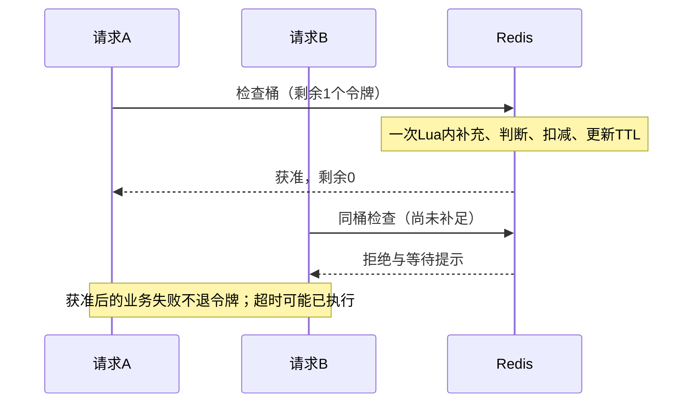
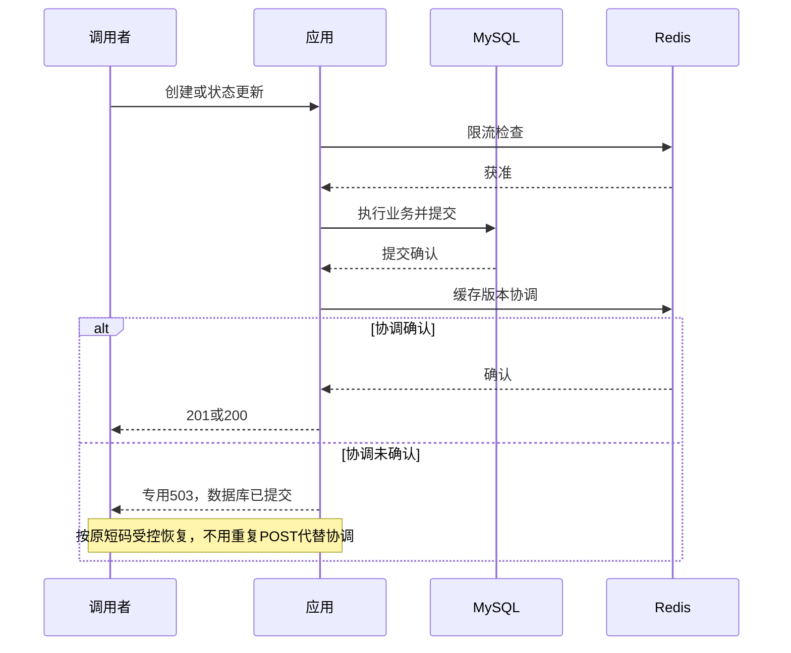

# 阶段 8：限流、工程化与最终收尾设计

> **历史设计，已实施。以下正文保留设计确认时点的原始事实与目标；“尚未实现”“本次只编辑设计”等表述不代表当前状态，accepted 表示设计已接受，不是测试结果。

用户已逐轮确认 Q1～Q23，并于 2026-10-04 通过 Q24 确认完整共识，本文状态为 accepted。

决策摘要见 [ADR-0008](../adr/0008-http-rate-limiting-and-final-hardening.md)，逐轮确认见 [讨论地图](../../.scratch/final-hardening/map.md)。术语沿用 [CONTEXT.md](../../CONTEXT.md)，现有实现说明见 [architecture.md](../架构与原理/architecture.md)。

## 1. 最终版本与停止线

目标是别人克隆仓库后能独立初始化并运行、能在 GitHub 看懂业务和证据、能写进 Java 后端实习简历、能完整解释设计取舍。

防护定位为基础防刷与资源保护：减少匿名批量创建、合法短码扫描和高频管理查询的资源压力。保留匿名创建，不新增注册登录、验证码、恶意网址识别，不承诺抵御大规模分布式攻击。共享出口 IP、轮换 IP、多客户端合力攻击均限制每 IP 策略的效果。

| 必须完成 | 验收结果 |
| --- | --- |
| 安全配置收尾 | 管理秘密无默认值，采集默认关闭，演示密钥独立生成，配置与文档一致 |
| Redis + Lua 分组令牌桶 | 并发正确、参数可配、明确 429 与按组故障策略 |
| 跳转回源并发保护 | 实际数据库加载有每实例并发上限，拒绝不计访问 |
| 最小 Actuator 与指标 | 自身、核心就绪、依赖/功能状态分离，安全暴露 |
| 安全日志与 API 文档 | 有定位线索，无敏感泄露，错误与统计契约完整 |
| 分层测试与基础 CI | 自动准备隔离设施，既有回归和新增验收可复现 |
| README/架构图/证据 | 运行入口清楚，目标和实际能力分开，简历结论可核验 |

Prometheus/Grafana 不作为必交付。不新增 Spring Cloud、Kafka、Elasticsearch、Kubernetes、网关、微服务、分库分表、outbox、事务消息、自动 DLQ 重放、Bloom Filter 或完整监控平台。今后存在真实需求与证据时另行讨论，不为增加技术名词扩展。

## 2. 当前事实与必须修正的缺口

当前已具备 MySQL 发号与短码编码、映射创建和跳转、状态管理、版本化 Redis 缓存与 Lua 协调、负缓存、TTL 抖动、实例内加载合并、匿名统计、RabbitMQ 有界异步发布/消费、eventId 幂等、分类有限重试/DLQ、安全依赖日志及丰富回归测试。

统计观察已有进程内 snapshot，不能说项目完全没有观测。核心池未显式设置容量和连接等待预算；Redis 无法确认 generation 时逐请求独立回源，不参加原有同码加载合并。

当前 application.yml 将管理令牌和访客 HMAC 设为同一个已提交默认值，并默认开启采集，与 README/ops 声明冲突。后续必须移除这些默认秘密、恢复已确认开关边界并同步文档，不能只改说明掩盖配置。

## 3. 接口、维度与起始额度

令牌桶初始化为满桶，每个获准请求消耗一个令牌，按配置速率补充且不超过容量。容量控制短时突发，补充速率控制长期速率；不代表严格的任意滚动时间窗次数上限。

| 请求 | 桶身份 | 容量 | 补充速率 | 限流判断失败 |
| --- | --- | --- | --- | --- |
| POST /api/links | 连接对端 IP + 创建分组 | 3 | 每 6 秒 1 个 | fail-close，业务前 503 |
| GET/HEAD /s/{code} | 连接对端 IP + 跳转分组，跨短码共享 | 60 | 每秒 10 个 | fail-open，继续原跳转流程 |
| PUT /api/links/{code}/enabled | 鉴权后的固定共享管理写分组 | 5 | 每秒 1 个 | fail-close，业务前 503 |
| GET/HEAD /api/internal/links/{code}/stats、/visits | 鉴权后的固定共享管理查询分组，两接口共用 | 5 | 每秒 1 个 | fail-close，查询前 503 |

参数全部可配置并校验合法性，是本地演示起点，不是已实测的安全容量。不同请求组的额度彼此独立。静态页面和健康探针不占用这些业务额度；本阶段不增加专门的未授权请求限流层，令牌错误保持低成本鉴权拒绝。

当前只按连接对端 IP 识别公开请求，不信任客户端 Forwarded/X-Forwarded-For。若环境把全部流量显示为一个对端，必须如实说明，不能声称已识别真实客户端。

不按用户限流，因为没有账号体系；UV Cookie 可重置，不能当可靠防刷身份。不以短码作为主要限流维度：换码扫描可绕开，热门短码还会聚合正常流量。不把原始管理令牌放入 Redis Key，固定管理操作分组已满足当前共享秘密模型。

## 4. 算法选择与 Lua 的作用

| 算法 | 特点 | 当前处理 |
| --- | --- | --- |
| 固定窗口 | 计数少、实现简单；边界两侧可集中通过接近两倍窗口额度 | 理解取舍，不实现 |
| 滑动窗口日志 | 精确统计最近一段时间内次数，需维护时间戳记录 | 理解取舍，不实现 |
| 滑动窗口计数 | 加权相邻窗口，状态少但近似 | 理解取舍，不实现 |
| 令牌桶 | 以容量和补充速率区分突发与长期速率 | 实现一套，各组参数不同 |

已有 Redis 和 Lua 缓存经验，因此复用 Redis 的边际引入成本较低；未来多个实例可共享同一额度。单实例本地限流也可行，不能声称 Redis 是必需品。代价是每次检查新增 Redis 交互，并与跳转缓存共享单节点故障和资源压力。

Lua 在同一次执行内完成读取、补充、判断、扣减和 TTL 更新，其他命令不能插入中间状态。只剩一个令牌时，并发请求不能同时读到相同额度并都获准。脚本必须短且有界，不扫描 Key，不动态生成无限脚本，不引入分布式锁。

原子执行不等于自动回滚、不等于与 MySQL 联合事务、不等于额度永久保存，也不保证网络响应一定送达。获准后业务失败仍可消耗令牌。

## 5. 准入顺序、错误与统计

创建在请求体解析和发号/写库前限流；额度耗尽时，无效创建请求可能先收到 429 而不是 400。跳转先廉价格式校验：非法短码沿用 ADR-0004 的 404，且不访问 Redis/MySQL；合法短码再限流，之后查缓存或数据库。合法但不存在的短码消耗额度，避免持续换合法短码无成本回源。

管理先执行原有令牌鉴权，再限流，再解析参数和执行业务。未配置管理秘密保持 404，缺失/错误/重复头保持 401；这些拒绝不进入限流 Redis 或 MySQL。获准后遇到参数错误、404/403/410、数据库失败或已有部分完成 503 不退还令牌。明确无令牌的拒绝不扣成负数。

| 响应 | 语义与副作用 |
| --- | --- |
| 429 RATE_LIMIT_EXCEEDED | 明确额度不足；Retry-After 为当前补充所需等待秒数向上取整，不承诺下一次必获准；Cache-Control: no-store |
| 限流不可用的独立 503 | 无法确认限流；创建/授权管理尚未进入业务，不宣称已提交，不携带“已创建”的结果 |
| 回源繁忙的独立 503 | 无实际查询许可，未作出正常跳转决定 |
| CREATE_CACHE_COORDINATION_UNCONFIRMED | 沿用现有契约：创建 MySQL 已提交，缓存协调未确认，携带已保存短码 |
| LINK_STATE_CACHE_COORDINATION_UNCONFIRMED | 沿用现有契约：状态 MySQL 已提交，缓存协调未确认 |

独立 503 的错误码在实现时固定并写入文档/测试，必须与两个既有部分完成码区分。前端按错误码与结果字段解释，不能把所有 503 显示为“已保存”；不因限流重复 POST 变更现有无请求幂等键语义。

所有限流和回源保护拒绝使用 no-store；HEAD 无响应体。拒绝不设置统计 Cookie、不冻结访问事件、不计 PV/UV。正常 GET 作出跳转决定后仍按既有最小化采集、best-effort 记录口径处理，HEAD 不计数。Redis 限流失败后的放行不是拒绝，若最终正常 GET 跳转，仍可生成访问事件。

## 6. 状态、时间与故障边界

限流 Key 与 shortlink:redirect:v2 缓存命名空间隔离。使用 Redis TIME 计算补充，空桶补满需时作为闲置 TTL 的下界；避免闲置过早过期重置额度。TTL 只清理闲置状态，不构成 Key 数量或全局内存硬上限；异常时钟和数值边界需要测试，不能产生负令牌或超过容量。

脚本参数化，使用 EVALSHA 并在 NOSCRIPT 时安全重载；脚本缓存丢失不等于需要关闭业务。网络扣减超时可能已经执行，不盲目再次扣减，按请求组 fail-open/fail-close 处理；应用不增加幂等扣费、持久化限流历史或补偿协议。

当前演示选择 noeviction，不主动通过淘汰限流桶缓解内存满。缓存重启仍遵守 [受控恢复说明](../故障排查/redis-recovery.md)，不能以额度可重置为理由复用未经检查的旧缓存快照。

保持现有 Redis 连接/命令短超时起点 200ms，不增加自动熔断或故障冷却。新增检查和缓存访问都可能增加故障等待，需测量；一次命令超时和连接池等待预算均不是 HTTP 总截止。客户端离线排队/重连行为需在实现中验证，不能引入不确定扣减的无限重试。

## 7. 数据库回源保护与资源预算

为实际跳转数据库加载设置每实例并发准入，起点 4、可配置。正常 miss、无 Redis 版本的故障回源、等待共享任务超时后的实际独立查询均适用。缓存命中和仅等待共享结果不占许可；真正执行一次共享查询只占一次。许可随真实查询完成/失败释放，不因某个等待者取消就提前释放仍在执行的查询。

无许可立即独立 503，不建立额外等待队列，不写成负缓存或统计事件。限流 fail-open 只允许进入跳转用例，仍可被这个保护拒绝。回源保护不能限制所有数据库工作、数据库连接获取后的内部等待、Redis 前等待或集群总查询数，不承诺数据库永远不被压垮。

| 资源 | 可配置起点 |
| --- | --- |
| 核心 Hikari | max 8；连接获取等待 500ms |
| 统计池 | 保留 max 4 与写/查询/清理准入 2/1/1 |
| 跳转实际回源 | 每实例同时最多 4 |

这些是演示预算起点，实施时测量和修正，不是经过验证的最低机器配置或总进程内存保证。核心回源上限不代表独占预留 4 个连接；两池仍共享 MySQL。

noeviction 满时相关写入/脚本可能报错，创建/管理限流关闭，跳转限流放行并按缓存/回源规则处理；不能声称 Redis PING 正常就表示全部功能可用。

四个常驻服务为 app/mysql/redis/rabbitmq，通过内部网络服务名连接。app 是一个 Spring Boot 进程，其中发布和消费统计；不是独立消费微服务。

仅向 localhost 发布应用、Actuator 管理及 RabbitMQ Management 端口。

身份密钥跨重启保持，不每次随机重置 UV 身份。

数据库 schema 与 MQ 初始化来源明确、可重复，不靠人工粘贴命令才能运行；MQ policy与声明顺序需要核验，不能在容量保护缺失时声称完整启动成功。初始化不得自动删除旧队列、清空积压或重建数据卷解决错误。账号或秘密修改后，已有卷的状态可能不随环境变量自动变化，文档区分首次初始化、普通重启、秘密轮换和明确的数据重置。

应用核心启动只等待 MySQL 健康，不等待 Redis/MQ 健康；broker 的后台声明/消费恢复保持原协议。完整演示验收等待全部组件并核验路由、policy 和消费。

## 9. 健康与最小观测

| 健康分组 | 含义 |
| --- | --- |
| liveness | 应用自身存活状态，不因外部故障改为死亡 |
| core readiness | 应用就绪且核心 MySQL 可用，不能把统计池聚合状态误纳入 |
| 依赖/功能状态 | Redis、MQ、采集/消费意图及实际状态分别展示，只输出安全固定类别 |

Redis 故障不阻断 core readiness，因为跳转仍能回源；创建/管理会按限流策略 503。MQ 故障允许核心启动/跳转，统计可能漏记或积压。统计池或消费者人为暂停不等于核心死亡，探针不能擅自开启消费或改写运维意图。

管理端口仅 health/info/metrics，info 仅安全应用/构建信息，不带环境或个人路径。主业务端口只提供无详情存活/就绪探针，验证主 HTTP 入口；管理详情无连接地址、秘密、SQL或原始异常。env/configprops/heapdump/动态日志修改等不开启，既有管理业务鉴权不会自动保护新增 Actuator，必须验证端口与暴露配置。

必要指标为 HTTP 次数/耗时、限流获准/拒绝/依赖失败、回源在途/拒绝、缓存结果/失败、池活跃/等待、既有 MQ 发布/消费终局与统计丢弃/积压观察。应用复用现有 snapshot；broker ready/unacked 等继续由受限 Management/已有观察脚本核对，不假装应用已自动取得所有 broker 指标。

标签只取请求组、模板路由、固定结果/错误类别。不用 IP、短码、原始 URL、访客摘要、eventId、requestId 或任意请求路径作指标标签。累计均速、保存延迟、HTTP 延迟和 broker 积压分别命名，保留现有观察数据的真实含义。

## 10. 日志与 API 文档

标准输出记录时间、级别、服务端 requestId、安全操作/结果类别及必要耗时；异步事件观察不承诺自动跨线程传播所有请求上下文。记录启动停止、Redis/MQ 降级恢复、已提交但缓存协调未确认、分类 MQ/清理失败。仅必要协调定位带短码，不逐成功跳转 INFO，不因攻击每条拒绝产生无限日志，使用按固定分组汇总或有界采样。

禁止原始 URL/查询串/请求体/管理令牌/Cookie/密钥/访客摘要/原始 IP/完整 Referer 或 UA/MQ payload/未经安全处理的依赖异常。保留 SafeDependencyConsoleEncoder，新增业务与 Redis 日志同样核验，不能把现有 JDBC/AMQP 编码器说成全局自动脱敏。日志不承担访问统计权威；运行日志不能重新存储已最小化前的访问信息。

使用兼容 Boot 3.5 的 springdoc OpenAPI 与本地 Swagger UI；固定兼容版本，不借文档功能顺便升级整个 Boot 主版本。接口表、参数限制、201/302/400/401/403/404/409/410/429/503、Location、no-store、Retry-After、HEAD无体及管理头完整。UI 不预填、不持久保存真实令牌，不把 Actuator 文档混入业务 API。

明确永久/限时、过期优先于禁用、重复状态操作409、创建无请求幂等键、部分完成协调恢复、管理秘密未配置关闭、PV/UV最近30统计日/跨日UV/异步可见性等现有边界。页面按错误码区分未进入业务的503与已提交协调未确认，必要时补错误提示，不扩展页面功能或前端技术栈。

## 11. 最终测试与 CI 验收矩阵

数据/端口/vhost与演示环境隔离，测试不操作个人数据库。

| 验收项 | 必须证明 |
| --- | --- |
| 原业务回归 | 发号/编码/创建、期限、状态、管理鉴权和正常跳转保持 |
| 缓存回归 | hit/miss、四类结果、TTL、版本协调、旧回填拒绝、多实例协议、故障恢复保持 |
| MQ/统计回归 | 有界交接、confirm/return、幂等、分类重试、DLQ、暂停恢复、生命周期、窗口/分页/清理保持 |
| 并发限流 | 稳定受控时间范围内竞争最后额度，实际获准数符合桶规则，不能只看相同响应推断原子性 |
| 分组/身份 | 创建/跳转/管理互不抢桶；跨短码跳转共用IP桶；两个管理查询共用桶；伪造转发头无效 |
| 补充/TTL/脚本 | 容量与补充边界、Retry-After、TTL无过早额度重置、NOSCRIPT重载、异常数值/时间边界 |
| 故障/内存压力 | 真实Redis断连/超时/写入内存压力按组处理；已执行但丢响应不盲目再次扣减 |
| 回源准入 | max4实际查询、缓存命中/等待共享任务不占用、无许可立即拒绝、异常与并发后无许可泄漏 |
| HTTP与副作用 | 429/独立503/部分完成503可区分；前两类无创建/状态副作用，HEAD无体，拒绝无Cookie/事件/PV |
| 配置安全 | 无默认秘密、未配置管理关闭、独立HMAC、采集开关、非法配置失败，示例不含真实秘密 |
| 健康/指标 | MQ或Redis停机不误判核心死亡，核心MySQL故障被readiness反映，统计池不误纳核心，主探针和端口隔离正确 |
| 日志隐私 | 用canary覆盖业务/Redis/JDBC/MQ错误；敏感输入不出现，安全类别和必要定位仍保留 |
| 文档/页面 | OpenAPI契约准确、管理头和HEAD明确、UI令牌不持久、503解释不误导 |

给出 Windows pwsh 与 Linux 命令入口、设施要求、预计测试类别和失败定位；GitHub Actions 执行必需回归/集成/冒烟并保存安全报告。测试证据列环境、提交/版本、结果、失败/错误/跳过数量，不追求机械100%覆盖率，不以“程序启动了”代替功能验收。

并发测试控制交叠和真实查询数；TTL/故障使用短配置、有界等待和适当容差，避免依赖偶然调度或长sleep。所需指标、端口、日志与脚本真实可用后再宣称验收；本轮没有新增或运行这些测试。

## 12. 性能与演示

不设置万级QPS目标。固定机器版本/数据量/并发/限流配置/样本数，分别观察缓存命中、不同码miss、Redis故障、MQ故障。把获准业务吞吐、429、503与数据库查询量分开，不以快速拒绝制造吞吐提升。记录业务成功率、p50/p95及样本足够时p99、CPU/内存/连接与在途预算；不能从少量顺序GET宣称高并发容量或生产SLA。

最短演示流程为初始化启动 → 创建并302 → 连续创建触发429 → 管理鉴权与状态切换 → 异步PV/UV查询 → 健康分组 → MQ停机仍跳转 → Redis停机创建拒绝/跳转回源及保护 → 按受控步骤恢复。故障演示使用隔离环境，正常数据/积压与明确重置分别说明。

历史事实：已有 [消费幂等验证](../../.scratch/consumer-idempotency/verification.md) 记录2026-10-04的263项通过、失败/错误/跳过均0，约4分06秒；这是历史执行记录，本轮未重新验证。已有 [异步统计验证](../../.scratch/async-visit-statistics/verification.md) 在本机Java17、loopback、单节点MySQL8.4/Redis7.2、并发1、30预热+300顺序GET下观察HTTP均值7.016ms→3.126ms、p95 8.486ms→3.928ms；只能描述本地同条件小样本。新增限流改变路径成本，后续需重新测量；不能复用旧数字当新版本性能。

## 13. README、架构图与简历

README 首页顺序：项目目标/实际已实现范围 → 截图与技术栈 → 组件架构图 → 一次初始化与启动 → 最短演示/API文档 → 分层测试命令 → 故障与隐私边界 → 正式设计/运维/验证链接。详细历史ADR和调优讨论另页，不把个人工作区路径、密码或.scratch作为唯一公共证明入口。实施后将必要验收证据整理到正式docs，保留历史来源与测量条件。

下图为目标架构，包含本阶段尚未实现的限流、回源准入与Actuator模块；不是当前代码现状图。

健康和Redis故障/302响应的细节以正文为准；图中业务箭头不表示跨组件原子事务。302指向外部原始URL，服务不代理目标站点。DLQ为有限诊断样本，不是可靠补偿存储。

Lua 原子边界示意：

数据库提交与协调边界示意（既有协议，不是新增事务）：

简历主线：MySQL发号/置换Base62及冲突边界；版本化Redis缓存/负缓存/旧回填防护/加载合并；有界RabbitMQ异步统计/eventId幂等/分类重试DLQ；本阶段验收后的Redis Lua分组限流和回源保护。

面试必须能解释：为何创建与跳转不同额度/故障策略；IP身份与热门短码取舍；三类算法；Lua并发原子性与超时不确定；Redis同时失去缓存和限流时的数据库压力；MQ本地接受/broker confirm/MySQL保存三个成功边界；429与业务前503、部分完成503；健康分组及日志隐私；测试如何证明而不是只断言相同响应。

当前新增能力只能写“计划”。实施验收后可写完成了按组限流及回源保护，但不能写生产抗DDoS、端到端恰好一次、不丢统计、强一致跨Redis故障切换、万级QPS或无条件55%性能提升。没有证据的数字不进入简历。

## 14. 后续实施顺序与设计验收

每步以真实行为和验收结果推进，不把新文档当实现证明。

需要用户另行明确授权才能进入开发。

## 参考

- [Redis 限流用途与原子检查](https://redis.io/docs/latest/develop/use-cases/rate-limiter/)
- [令牌桶与算法比较](https://redis.io/docs/latest/develop/use-cases/rate-limiter/java-lettuce/)
- [Lua 脚本原子执行与缓存](https://redis.io/docs/latest/develop/programmability/eval-intro/)
- [Redis 内存与淘汰策略](https://redis.io/docs/latest/develop/reference/eviction/)
- [429 与 Retry-After](https://www.rfc-editor.org/rfc/rfc6585.html#section-4)
- [Spring Boot 3.5 Actuator](https://docs.spring.io/spring-boot/3.5/reference/actuator/endpoints.html)
- [Hikari 配置](https://github.com/brettwooldridge/HikariCP#configuration-knobs-baby)
- [springdoc](https://springdoc.org/)
